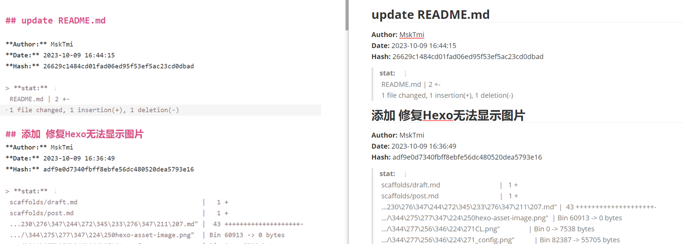

# Git 导出日志
## 格式化输出时间
- `--date=relative`：显示相对于当前时间的日期，如“2 hours ago”。
- `--date=local`：显示本地时区的日期，如“2023-04-10 11:39:41 +0800”。
- `--date=default`：显示默认的日期格式，如“Tue Apr 10 11:39:41 2023 +0800”。
- `--date=iso`：显示ISO 8601标准的日期格式，如“2023-04-10 11:39:41 +0800”。
- `--date=iso-strict`：显示ISO 8601标准的严格日期格式，如“2023-04-10T11:39:41+08:00”。
- `--date=rfc`：显示RFC 2822标准的日期格式，如“Tue, 10 Apr 2023 11:39:41 +0800”。
- `--date=short`：显示简短的日期格式，如“2023-04-10”。
- `--date=raw`：显示原始的日期格式，如“1618036781 +0800”。
- `--date=format:<format>`：显示自定义的日期格式，其中 `<format>` 是一个字符串，可以包含以下占位符：
  - `%a`：缩写的星期名，如“Tue”。
  - `%A`：完整的星期名，如“Tuesday”。
  - `%b`：缩写的月份名，如“Apr”。
  - `%B`：完整的月份名，如“April”。
  - `%c`：适合本地区域的日期和时间表示，如“Tue Apr 10 11:39:41 2023”。
  - `%d`：十进制表示的月份中的第几天（01 – 31），如“10”。
  - `%H`：24小时制表示的小时（00 – 23），如“11”。
  - `%I`：12小时制表示的小时（01 – 12），如“11”。
  - `%j`：十进制表示的年份中的第几天（001 – 366），如“100”。
  - `%m`：十进制表示的月份（01 – 12），如“04”。
  - `%M`：十进制表示的分钟（00 – 59），如“39”。
  - `%p`：当前区域设置下的上午/下午指示符，如“A.M.”或“P.M.”。
  - `%S`：十进制表示的秒（00 – 59），如“41”。
  - `%U`：十进制表示的一年中的第几周，以星期日为一周的第一天（00 – 53），如“15”。
  - `%w`：十进制表示的星期几（0 – 6；星期日是0），如“2”。
  - `%W`：十进制表示的一年中的第几周，以星期一为一周的第一天（00 – 53），如“15”。
  - `%x`：适合本地区域的日期表示，如“04/10/23”。
  - `%X`：适合本地区域的时间表示，如“11:39:41”。
  - `%y`：不带世纪部分的十进制表示的年份（00 – 99），如“23”。
  - `%Y`：带世纪部分的十进制表示的年份，如“2023”。
  - `%z, %Z`：时区名称或时区缩写，取决于注册表
  - `%%`：百分号

例：
`git log --date=format:'%Y-%m-%d %X'`
> 输出 YYYY–MM–DD HH:MM:SS | 2023-10-10 14:31:01

## `--pretty=format` 格式化输出日志
| 参数  | 说明                                          |
| :---: | --------------------------------------------- |
| `%H`  | 提交的完整哈希值                              |
| `%h`  | 提交的简写哈希值                              |
| `%T`  | 树的完整哈希值                                |
| `%t`  | 树的简写哈希值                                |
| `%P`  | 父提交的完整哈希值                            |
| `%p`  | 父提交的简写哈希值                            |
| `%an` | 作者名字                                      |
| `%ae` | 作者的电子邮件地址                            |
| `%ad` | 作者修订日期（可以用 --date=选项 来定制格式） |
| `%ar` | 作者修订日期，按多久以前的方式 相对时间显示   |
| `%cn` | 提交者的名字                                  |
| `%ce` | 提交者的电子邮件地址                          |
| `%cd` | 提交日期                                      |
| `%cr` | 提交日期（距今多长时间）                      |
| `%s ` | 提交说明                                      |

## 格式化导出为 Markdown
命令：  
`git log --stat --date=format:'%Y-%m-%d %X' --pretty=format:'## %s%n**Author:** %an%n**Date:** %ad%n**Hash:** %H%n> **stat:**  ' >log.md`

效果：

