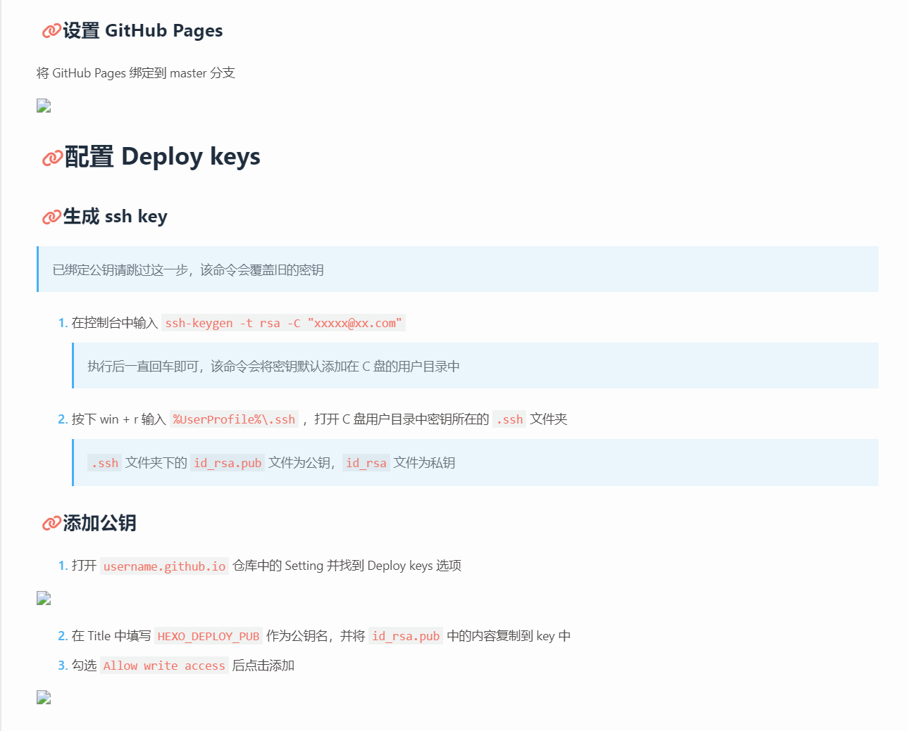
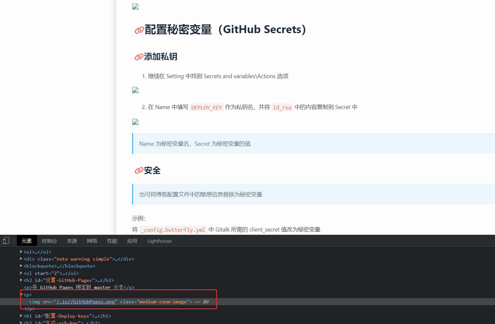
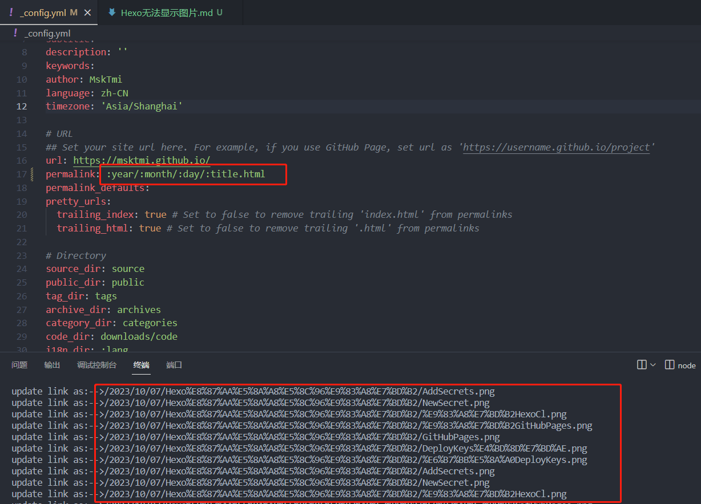

# 起因
刚写完第一篇文章满怀期待的上传，然后 Hexo 给了我个惊喜 ———— 没有图片！  




# 具体问题

使用 Markdown 插入**本地图片**时Hexo渲染的静态页面中的图片路径错误
> 使用 Markdown 插入图片：`` 


# 解决方案

1. 使用 hexo-asset-image 给hexo中的资源图片指定绝对路径  
   在控制台中输入 `npm install hexo-asset-image --save` 安装
   > 由于 hexo-asset-image 太久未维护，直接使用会有些问题
   >
   > 
2. 所以需要在 Hexo/_config.yml 中修改 `permalink` 配置
   ```yaml
   # permalink: :year/:month/:day/:title/
   permalink: :year/:month/:day/:title.html
   ```
   > 使博客的链接地址显示 `.html` 后缀

   
3. 修改工作流配置，将 **判断是否已缓存** 暂时注释，来让 GitHub Actions 安装 hexo-asset-image
   > 未使用 GitHub Actions 无视

   

# 成功！

