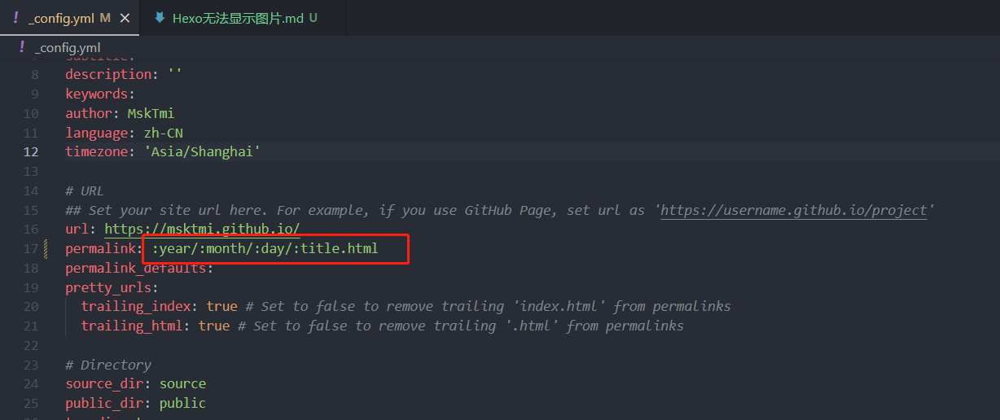

# 起因
刚写完第一篇文章满怀期待的上传，然后 Hexo 给了我个惊喜 ———— 没有图片！  


# 文章中图片无法显示

使用 Markdown 插入**本地图片**时Hexo渲染的静态页面中的图片路径错误
> 使用 Markdown 插入图片：`` 


## 解决方案
1. 在 Hexo/_config.yml 中修改 `post_asset_folder` 配置 为 `true` ，将每篇博客的资源文件单独放置在与文章同名的文件夹中
   > `post_asset_folder: true`
2. 使用 hexo-asset-image 给 hexo 中的资源图片指定绝对路径  
   在控制台中输入 `npm install hexo-asset-image --save` 安装
   > 由于 hexo-asset-image 太久未维护，直接使用会有些问题
   >
   > 
3. 所以还需要在 Hexo/_config.yml 中修改 `permalink` 配置
   ```yaml
   # permalink: :year/:month/:day/:title/
   permalink: :year/:month/:day/:title.html
   ```
   > 使博客的链接地址显示 `.html` 后缀

   
4. 修改工作流配置，将 **判断是否已缓存** 暂时注释，来让 GitHub Actions 安装 hexo-asset-image
   > 未使用 GitHub Actions 无视

   

## 成功！


# 封面显示设置

在 `_config.yml` 中开启 `post_asset_folder` 后 Hexo 文章封面的路径是 `permalink` 中设置的路径 + 图片名

```yaml
# Url
permalink: :year/:month/:day/:title.html

# 封面   year/month/day/title/图片名
cover: ./2023/10/09/4089126318/404封面.png
```

## hexo-abbrlink
推荐使用 [hexo-abbrlink](https://github.com/rozbo/hexo-abbrlink) 将网页链接的标题部分转为十六进制，这样在分享网页过程中可以避免链接中包含中文导致超链接显示不全等问题
安装：`npm install hexo-abbrlink --save`

### 配置
1. 使用 npm 安装
2. 在 `_config.yml` 中添加 hexo-abbrlink 配置
   ```yaml
   # url
   permalink: :year/:month/:day/:abbrlink.html

   # abbrlink config 使用 dec 可将标题转为十进制
   abbrlink:
      alg: crc32      #support crc16(default) and crc32
      rep: dec        #support dec(default) and hex
   ```
   
3. 修改封面地址为 hexo-abbrlink 生成的链接
   

## 最终结果
