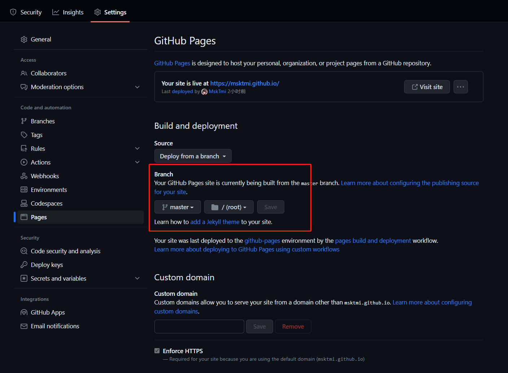
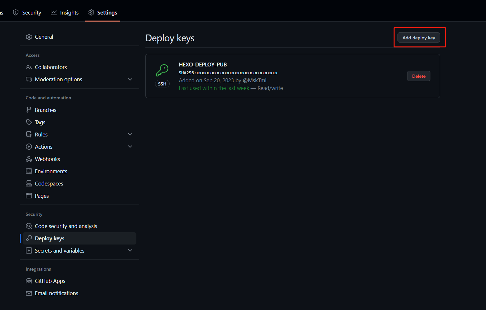
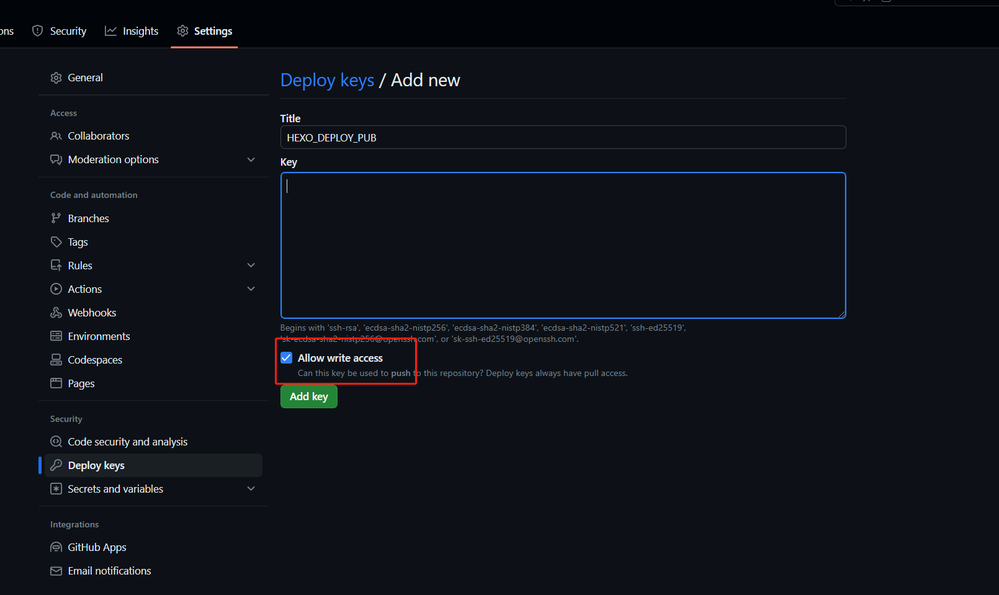
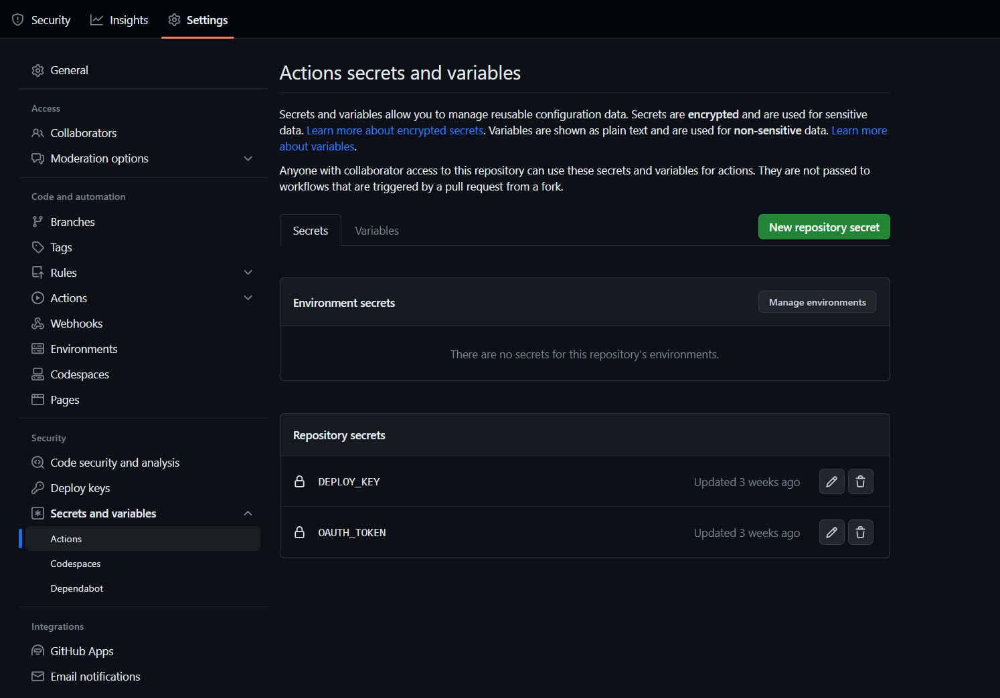
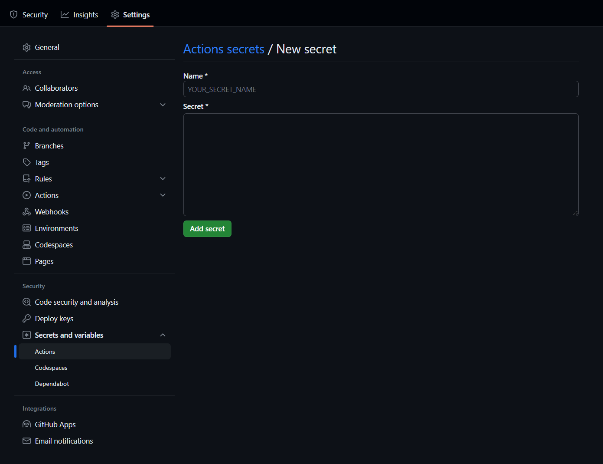
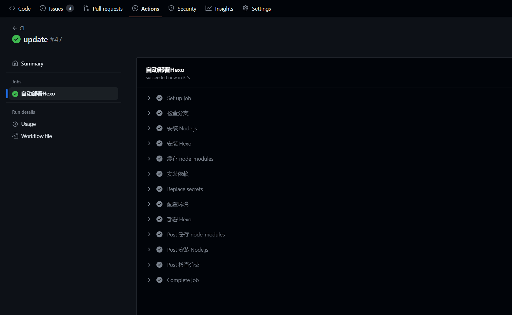
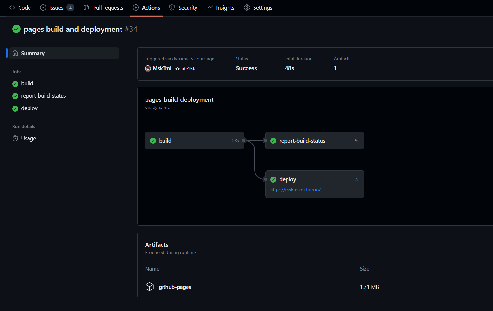

# 准备工作

1. 简单了解 [Hexo](https://hexo.io/docs/index.html)，[GitHub Actions](https://docs.github.com/actions) 以及 [Github Secrets](https://docs.github.com/actions/security-guides/using-secrets-in-github-actions)
2. 安装 Hexo
3. 熟练使用 Baidu 或 Bing 大小姐

# 源码与网页同仓库方案

源码与渲染后的博客静态页面放在同一个仓库的不同分支，  以 Hexo 分支为源码，master 分支为渲染后的静态页面

## 创建仓库
1. 创建名称为 `username.github.io` 的仓库
   
  
username 是自己的用户名  


> 使用 GitHub Actions 部署到 Github Pages 时，存放部署网站静态文件的仓库名必须为 username.github.io ，这与 Github Page 的配置有关，部署后将得到一个名为：https://username.github.io 的网站

2. 如果Hexo根目录还没有仓库，执行以下指令新建并上传到 GitHub  
```shell
git init
git add .
git commit -m "first commit"
git branch -M master
git remote add origin https://github.com/username/username.github.io.git
git push -u origin master
```

3. 新建并转到 hexo 分支，再将新创建的分支信息推送到 Github
```shell
git checkout -b Hexo
git push origin HEAD -u
```
> 推送后仓库中有两个分支，一个为默认的master分支，另一个新建的hexo分支，之后 hexo deploy 部署的静态页面会覆盖 master 分支中的文件，这样 master 分支中就是最后 `/public` 下的静态页面

## 设置 GitHub Pages
将 GitHub Pages 绑定到 master 分支


# 配置 Deploy keys
## 生成 ssh key
> 已绑定公钥请跳过这一步，该命令会覆盖旧的密钥

1. 在控制台中输入 `ssh-keygen -t rsa -C "xxxxx@xx.com"`
> 执行后一直回车即可，该命令会将密钥默认添加在C盘的用户目录中

2. 按下 win + r 输入 `%UserProfile%\.ssh` ，打开C盘用户目录中密钥所在的 `.ssh` 文件夹
> `.ssh` 文件夹下的 `id_rsa.pub` 文件为公钥，`id_rsa` 文件为私钥

## 添加公钥
1. 打开 `username.github.io` 仓库中的 Setting 并找到 Deploy keys 选项



2. 在 Title 中填写 `HEXO_DEPLOY_PUB` 作为公钥名，并将 `id_rsa.pub` 中的内容复制到 key 中
3. 勾选 `Allow write access` 后点击添加



# 配置秘密变量（GitHub Secrets）
## 添加私钥
1. 继续在 Setting 中找到 Secrets and variables\Actions 选项



2. 在 Name 中填写 `DEPLOY_KEY` 作为私钥名，并将 `id_rsa` 中的内容复制到 Secret 中



> Name 为秘密变量名，Secret 为秘密变量的值
## 安全
> 也可将博客配置文件中的敏感信息替换为秘密变量  

示例：  
将 `_config.butterfly.yml` 中 Gitalk 所需的 client_secret 值改为秘密变量
```yaml
# gitalk
# https://github.com/gitalk/gitalk
gitalk:
  client_id: xxxxxxxxxxxxx
  client_secret: OAUTH_TOKEN # 使用GitHub Secrets
  repo: username.github.io 
  owner: username
  admin: username
  option:
```
1. 在项目仓库的 Setting\Secrets and variables\Actions 中添加 Name 为 OAUTH_TOKEN 的秘密变量
2. 在 HexoCl.yml 中添加
```yaml
- name: Replace secrets
  run: |
    sed -i 's/OAUTH_TOKEN/${{ secrets.OAUTH_TOKEN }}/' ./_config.butterfly.yml
```
> 可以将 `_config.butterfly.yml` 文件中的 `OAUTH_TOKEN` 字符替换为 `${{ secrets.OAUTH_TOKEN }}` 变量的值
# GitHub 工作流配置
1. 在 Hexo 目录或 GitHub 中新建 `.github/workflows/` 目录，目录中新建 `HexoCI.yml` 文件  
   这里给一个示例 GitHub 工作流配置的方式可查阅 GitHub 官方文档说明

2. 编写 `HexoCI.yml` 工作流配置（大部分可直接 copy）
```yaml  
name: CI
on:
  push:
    branches: [ "Hexo" ] #源码分支名
jobs:
  build:
    runs-on: ubuntu-latest
    name: 自动部署Hexo
    steps:
      - name: 检查分支
        uses: actions/checkout@v2
        with:
          ref: Hexo

      - name: 安装 Node.js
        uses: actions/setup-node@v3.8.1
        with:
          node-version: "16.x"

      - name: 安装 Hexo
        run: |
          npm install hexo-cli -g --save

      - name: 缓存 node-modules
        id: cache-npm
        uses: actions/cache@v3
        env:
          cache-name: cache-node-modules
        with:
          path: node_modules
          key: ${{ runner.os }}-build-${{ env.cache-name }}-${{ hashFiles('**/package-lock.json') }}
          restore-keys: |
            ${{ runner.os }}-build-${{ env.cache-name }}-
            ${{ runner.os }}-build-
            ${{ runner.os }}-

      - name: 安装依赖
        if: ${{ steps.cache-npm.outputs.cache-hit != 'true' }}
        run: |
          npm install --save

      - name: 配置环境 #记得修改 email 和 name
        env:
          DEPLOY_KEY: ${{ secrets.DEPLOY_KEY }} #这里的 "DEPLOY_KEY" 是之前设置秘密变量的名字
        run: |
          mkdir -p ~/.ssh/
          echo "$DEPLOY_KEY" > ~/.ssh/id_rsa
          chmod 600 ~/.ssh/id_rsa
          ssh-keyscan github.com >> ~/.ssh/known_hosts
          git config --global user.email "useremail" 
          git config --global user.name "username"
          ssh-keygen -y -f ~/.ssh/id_rsa

      - name: 部署 Hexo 
        run: |
          hexo clean
          hexo d
```
# Hexo 配置
在项目根目录中修改 _config.yml ，增加部署相关内容：
```yaml
deploy:
  type: git
  repo: git@github.com:username/username.github.io.git
  branch: master
```
> 这里的repox需要填写ssh的形式

# 查看结果
最后只需要在 Hexo 分支上推送代码即可自动部署博客，执行过程可以在 Actions 中查看  
完成后直接访问 https://username.github.io.git 查看博客




