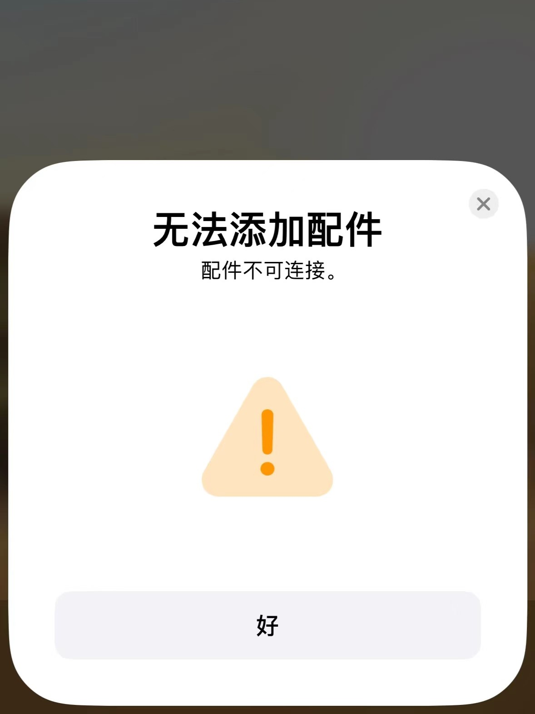
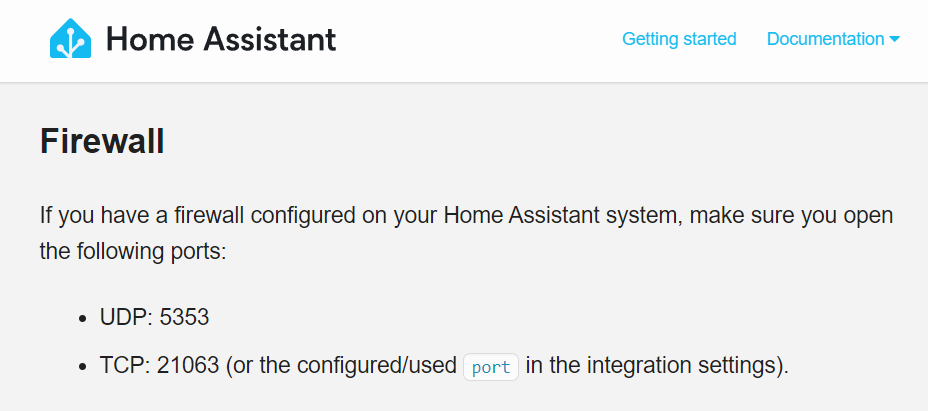
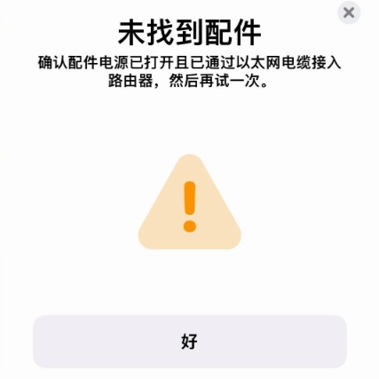
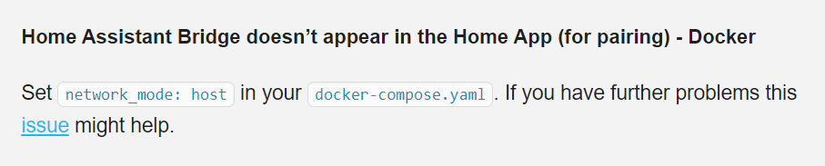

## 解决过程

在使用 HomeAssistant 将米家设备接入 HomeKit 的时候，HomeKit 提示无法添加配件（配件不可连接）  

简单说一下配置流程：
1. 安装 [HomeAssistant](https://hub.docker.com/r/homeassistant/home-assistant) 
2. 安装 [HACS](https://github.com/hacs-china/integration) 
3. 安装 [Xiaomi Miot Auto](https://github.com/al-one/hass-xiaomi-miot/blob/master/README_zh.md) 绑定账号 
4.  安装并配置 [HomeKit Bridge](https://my.home-assistant.io/redirect/config_flow_start?domain=homekit) 
5.  扫码连接  

前面的配置流程都很顺利的完成了，最后用手机扫码连接时会进行漫长的加载，然后 HomeKit 就会提示无法添加配件，在网上找了好久翻了很多贴子，都没有找到和我同样的问题  
 

最后看了 [HomeKit Bridge](https://www.home-assistant.io/integrations/homekit/) 的官方文档，发现使用 HomeKit Bridge 还需要在防火墙中开放 `UDP: 5353 和 TCP: 21063` 端口  
如此基础的问题百度出来的教程里居然没有一个人讲到，在这里记录一下

> 安装东西还得看官方文档，又交了一个多小时学费😭

## 其他问题
在解决这个问题的过程中还碰到搜到了另一个问题，也是卡在了最后一步，报错提示是未找到配件  

[这个问题](https://github.com/home-assistant/core/issues/15692)是因为在配置 docker-compose 时设置了端口转发，应该在 docker-compose 中配置 `network_mode: host` 使用主机模式
