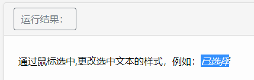
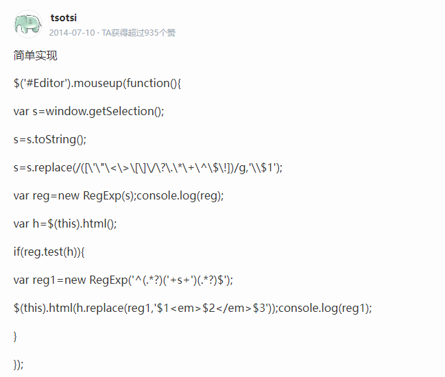

# 方法

```JavaScript
$('p').mouseup(function(){
    var s=window.getSelection();
    s=s.toString();
    s=s.replace(/([\'\"\<\>\[\]\/\?\.\*\+\^\$\!])/g,'\\$1');
    var reg=new RegExp(s);
    console.log(reg);
    var h=$(this).html();
    if(reg.test(h)){
        var reg1=new RegExp('^(.*?)('+s+')(.*?)$');
        $(this).html(h.replace(reg1,'$1<em>$2</em>$3'));
        console.log(reg1);
    }
});
```


# 来源

​转自百度知道大佬：[tsotsi](https://zhidao.baidu.com/usercenter?uid=56de4069236f25705e798e07&role=ugc)



