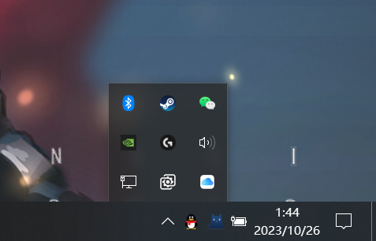
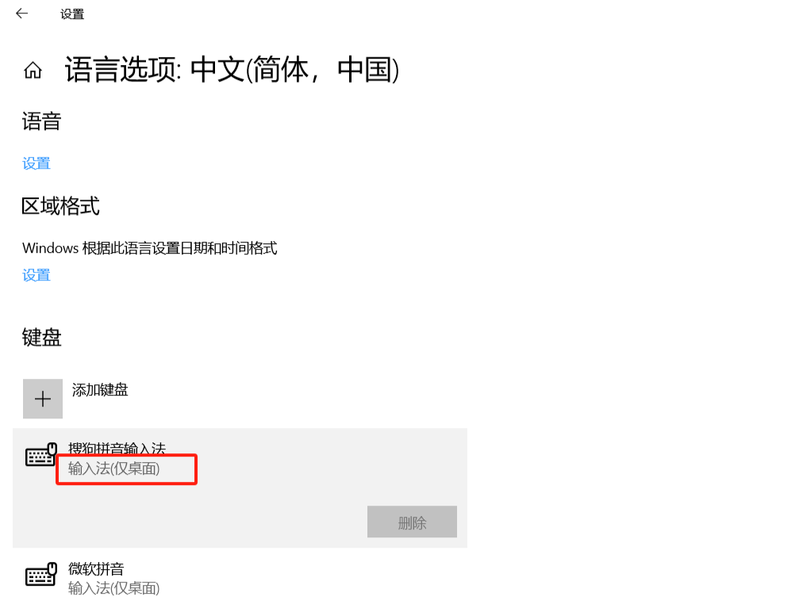
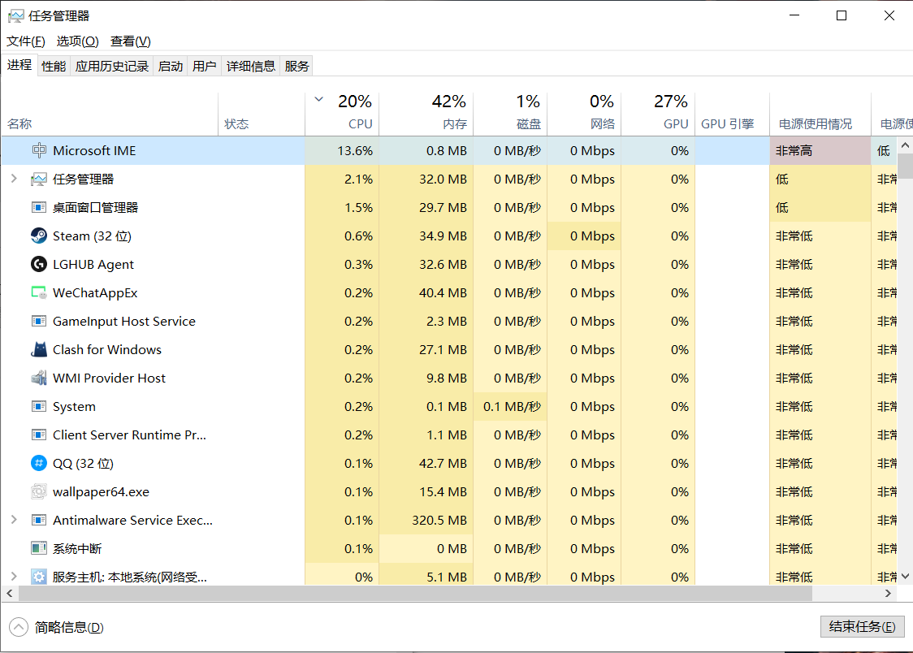
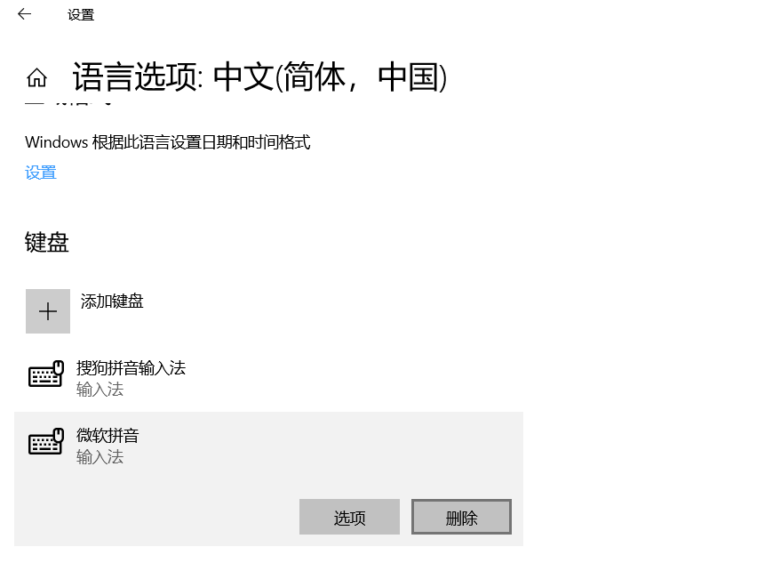
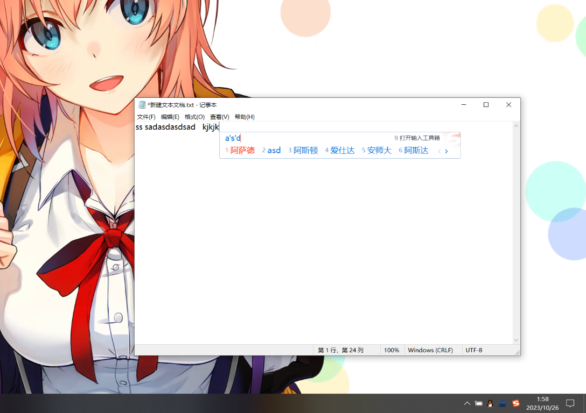

在一次普通的重启后我的突然输入法挂掉了，在中重装输入法与重启电脑后依然没有恢复正常，看来是阿三程序员留给我的小惊喜

# 问题描述

1. 无法输入中文且不会跳出输入备选框
2. 使用 **win+space** 切换输入法也没有任何反应
3. 右下角语言栏消失  

1. 语言设置界面显示："输入法(仅桌面)"  

# 解决方案

百度的结果五花八门，大部分可以通过重新运行 `ctfmon.exe` 解决，但对我却无效，就在任务管理器中查找 **CTF 加载程序 (ctfmon.exe)** 是否正常运行时发现 **Microsoft IME** 这个进程 CPU 占用飞起  

直接右键干掉后输入法立马就出来了，但是重启过后依然是同样的问题  
顺着这个思路去网上找了找解决方案，发现直接在 **Windows 设置>时间和语言>语言>首选语言>选项>键盘** 中删除微软输入法就可以解决了

重启后一切正常

# 可能的原因

有可能是因为我禁用了 **触摸键盘服务（TabletInputService）** 的问题，这个服务会在登录界面输入 PIN 时弹出虚拟键盘，但之前几次重启后没有异常，只有这次出现了问题  
不过好在问题是解决了，既不用被虚拟键盘骚扰也能正常打字 winwin