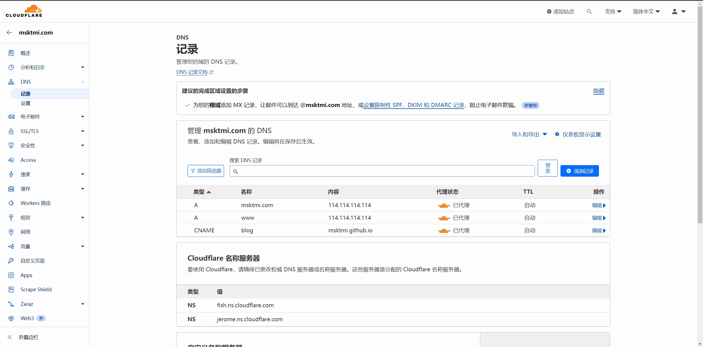
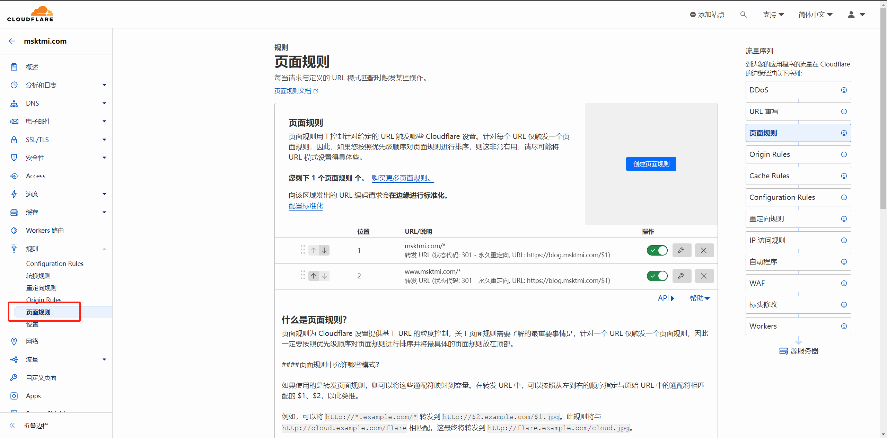
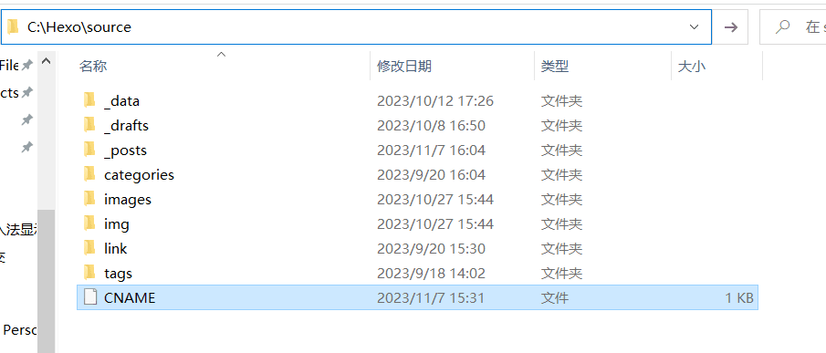
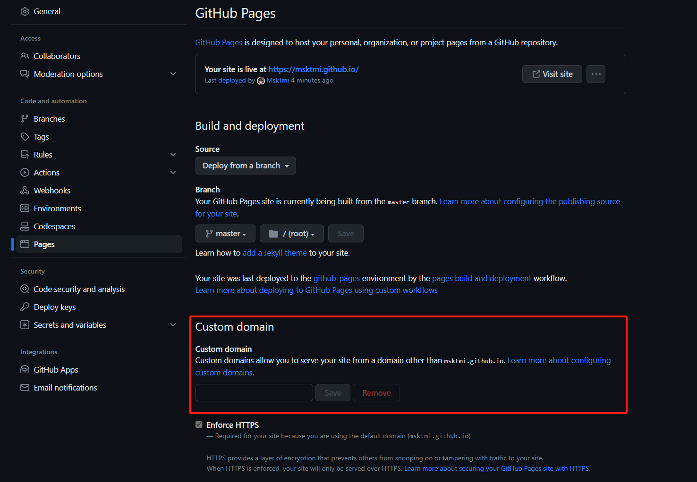
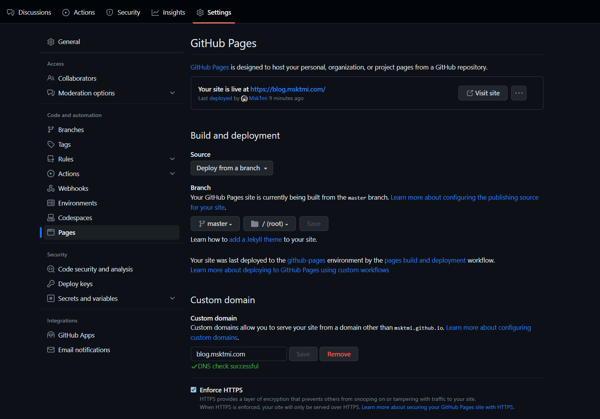
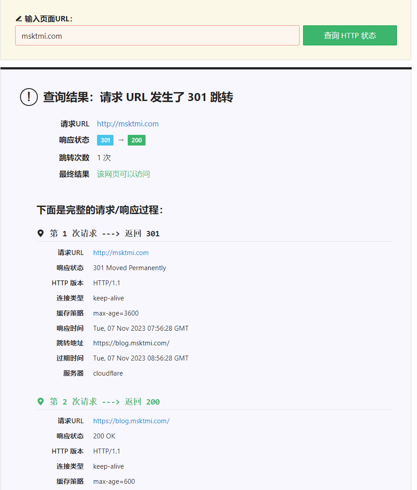

# 背景

前段时间买了域名，但除了挂博客外目前没有其他用途，于是在折腾一段时间后终于把博客挂在了二级域名（blog）下，并设置 apex 域和 www 子域的301重定向到二级域名下（域名空着也是空着不如先用起来）  
所以我需要的操作是把 blog 指向 example.github.io ，并将 顶级域名 和 www 指向 blog  
> example.com && www.example.com -> blog.example.com -> example.github.io

由于 GitHub Pages 只能设置一个 CNAME 所以便有了这篇文章~

## 301 重定向

301重定向多用于迁移网站时将旧的资源重定向到新的域名下，我了解到的实现重定向的方法大致可以分为三类  
1. 使用服务器或是虚拟主机转发，但大多需要额外付费
2. 新建 GitHub 仓库，利用仓库中的 GitHub Pages 再设置一个 CNAME 重定向，需要几个转发就要创建几个仓库，如果只需要一个重定向可以选择这种方法
3. 使用其他服务商进行转发，例如白嫖 Cloudflare (～￣▽￣)～ 
   > Cloudflare 的 Free 计划可以设置三个页面转发规则

# Cloudflare 设置
## 注册
1. 注册  [Cloudflare]([./使用Cloudflare对blog进行301重定向/提示.png](https://dash.cloudflare.com/sign-up)) 账号，选择 Free 计划，如果你恰巧实力雄厚也可以选择 Pro 计划等
2. 进入到控制台中，在左边的`网站`标签中添加你的域名
3. 在你的域名服务商那边修改 DNS 为 Cloudflare 提供的 DNS 服务器
    - `fish.ns.cloudflare.com`
    - `jerome.ns.cloudflare.com`

## 设置 DNS 记录（解析）
直接在 `DNS/记录` 下添加记录即可
| 类型  |    名称    |       内容       | 代理状态 |  TTL  |
| :---: | :--------: | :--------------: | :------: | :---: |
|   A   | example.com |     8.8.8.8      |  已代理  | 自动  |
|   A   |    www     |     8.8.8.8      |  已代理  | 自动  |
| CNAME |    blog    | example.github.io |  已代理  | 自动  |

`CNAME 记录` 设置 blog.example.com 重定向到 example.github.io  
`A 记录`设置好需要转发的域名，内容随便写就行

## 设置转发规则
直接在 `规则/页面规则` 下添加记录即可
|        URL         |   设置   | 状态代码 |           目标 URL           |
| :----------------: | :------: | :------: | :--------------------------: |
|   `example.com/*`   | 转发 URL |   301    | `https://blog.example.com/$1` |
| `www.example.com/*` | 转发 URL |   301    | `https://blog.example.com/$1` |

在转发 URL 中，可以按照从左到右的顺序指定与原始 URL 中的通配符（*）相匹配的 $1、$2，以此类推

例如：  
可以将 `http://*.example.com/*` 转发到 `http://$2.example.com/$1.jpg`  
此规则将与 `http://cloud.example.com/flare`相匹配，这最终将转发到 `http://flare.example.com/cloud.jpg`

### 一些有用的提示：

1. 如果要同时匹配 http 和 https，只需编写 example.com 即可，无需编写 example.com
2. 如果要匹配域中的每个页面，则需要编写 example.com/，仅编写 example.com 是不够的
3. 请参阅 [了解和配置 Cloudflare 页面规则](https://developers.cloudflare.com/support/page-rules/understanding-and-configuring-cloudflare-page-rules-page-rules-tutorial/) 了解有关页面规则模式的更多详细信息

# 创建 CNAME 文件

在发布的静态页面根目录下创建一个 `CNAME` 文件，用于将一个域名指向另一个域名   
这里用 Hexo 举例，在 `Hexo/source/` 下创建一个 `CNAME` 文件，这样 Hexo 在发布时会将 source 下的 CNAME 文件一起打包到 public 文件中  
内容为 `自定义子域.顶级域名.后缀` 自定义子域为 Cloudflare 中设置的 CNAME  
例如：`blog.example.com`

# 在 GitHub Pages 中设置
> 如果你的博客不在 GitHub Pages 下可以跳进下个标题

在域名解析完成后，可以在项目中的 GitHub Pages 设置页面指定其他的域名

因为使用的是 `CNAME` 解析，在设置完成后 GitHub Pages 会自动在仓库中创建一个 `CNAME` 文件，但如果只修改这里，使用 [GitHub Actions 自动部署](https://blog.msktmi.com/2023/10/07/2933477798.html)时会覆盖掉旧的仓库  
为了避免发生这种情况需要在 `Hexo/source/` 下创建一个 `CNAME` 文件，这样可以将 CNAME 作为博客的一部分发布，GitHub Pages 设置页面也会自动同步 CNAME 文件中的信息

# 测试重定向配置

  
域名配置DNS和设置301重定向后建议等待几小时后再进行测试  
延迟时间取决于多个因素，可能是DNS服务器的缓存、浏览器的缓存、网络的延迟等  
建议在测试301转跳是时开启控制台并在网络选项中禁用缓存


也可以在这个网站进行测试：[HTTP状态检测](https://www.dute.org/httpstatus)

