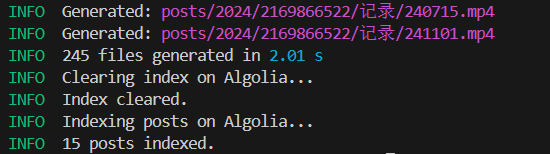
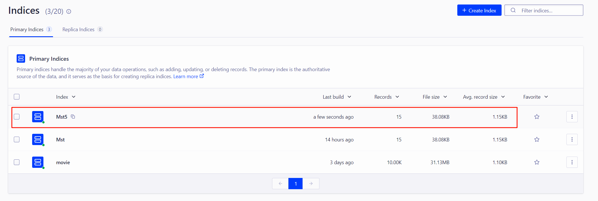

在使用 hexo-algoliasearch 为 Hexo 添加搜索功能时出现了找不到 db.json 的报错
> db.json 会在运行 `hexo server` 时生成，单独运行 `hexo algolia` 就会出现这个问题  
> Issues: [hexo-algoliasearch #173](https://github.com/LouisBarranqueiro/hexo-algoliasearch/issues/173)  

```shell
node:internal/process/promises:394
    triggerUncaughtException(err, true /* fromPromise */);
    ^
[OperationalError: ENOENT: no such file or directory, open 'G:\Blog\MskTmi.github.io\db.json'] {
  cause: [Error: ENOENT: no such file or directory, open 'G:\Blog\MskTmi.github.io\db.json'] {
    errno: -4058,
    code: 'ENOENT',
    syscall: 'open',
    path: 'G:\\Blog\\MskTmi.github.io\\db.json'
  },
  isOperational: true,
  errno: -4058,
  code: 'ENOENT',
  syscall: 'open',
  path: 'G:\\Blog\\MskTmi.github.io\\db.json'
}
```

## 解决方案

我的解决方案是直接删除读取 db.json 的部分，经过与正常生成的索引对比发现，db.json 并没有影响生成结果
> 如果有误请大佬在评论区中指正

Q：那为什么不先运行 `hexo server` 时生成 db.json，非要单独运行 `hexo algolia` 呢？  
A：在某些特殊场景，例如使用 Github Actions 部署博客时，不能运行 `hexo server` 开启服务，也不能先运行 `hexo deploy`，以避免 [hexo-deployer-git](https://github.com/hexojs/hexo-deployer-git) 触发 git 推送命令

这边有两种做法，推荐第一种  
- 使用博主制作的修改版，已上传 npm
- 使用 js 生成 db.json 后再运行 `hexo algolia`


<!-- tab 修改版 @fa-solid fa-wrench -->
### 使用修改版
使用修改后的 hexo-algoliasearch ，直接使用npm安装即可
```shell
npm install @msktmi/hexo-algoliasearch --save
```
如果已安装 hexo-algoliasearch 记得卸载原版本
```shell
npm uninstall hexo-algoliasearch --save
```
具体修改内容可以查看提交记录  
项目地址：https://github.com/MskTmi/hexo-algoliasearch  
npm地址：https://www.npmjs.com/package/@msktmi/hexo-algoliasearch

<!-- endtab -->

<!-- tab 手动生成 db.josn @fa-regular fa-file-lines -->
### 使用 js 生成 db.json

1. 在项目根目录新一个 `generate-db.js` 文件
```JavaScript
// 用于解决 https://github.com/LouisBarranqueiro/hexo-algoliasearch/issues/173
// 生成前运行 $ node generate-db.js
const Hexo = require('hexo');
const fs = require('fs');

// 忽略循环引用
function safeStringify(obj) {
    const seen = new WeakSet();
    return JSON.stringify(obj, (key, value) => {
        if (typeof value === 'object' && value !== null) {
            if (seen.has(value)) {
                return;
            }
            seen.add(value);
        }
        return value;
    }, 2);
}

async function generateDb() {
    const hexo = new Hexo(process.cwd(), {});

    try {
        console.log('Initializing Hexo...');
        await hexo.init(); // 初始化 Hexo
        console.log('Loading data...');
        await hexo.load(); // 加载 Hexo 数据

        // 获取完整的 Hexo 数据
        const data = hexo.locals.toObject();

        // 使用 safeStringify 写入 db.json
        const outputPath = './db.json';
        fs.writeFileSync(outputPath, safeStringify(data));
        console.log(`db.json has been generated at: ${outputPath}`);
    } catch (err) {
        console.error('Error generating db.json:', err);
        process.exit(1);
    }
}

generateDb();
```
2. 使用终端运行 js 脚本生成 db.json  
```shell
node generate-db.js 
```

#### 在 Github Actions 中使用
> 没有需求可忽略 
```yaml
# 更新 Algolia 索引
- name: 生成 db.json 文件
  run: node generate-db.js

- name: 替换配置文件中的密钥
  run: sed -i 's/ALGOLIA_WRITE_API_KEY/${{ secrets.ALGOLIA_WRITE_API_KEY }}/' ./_config.yml

- name: 上传索引内容到 Algolia
  run: hexo algolia
```
<!-- endtab -->



## 效果


