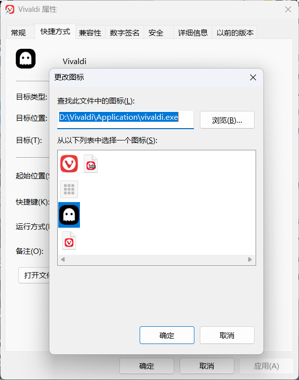
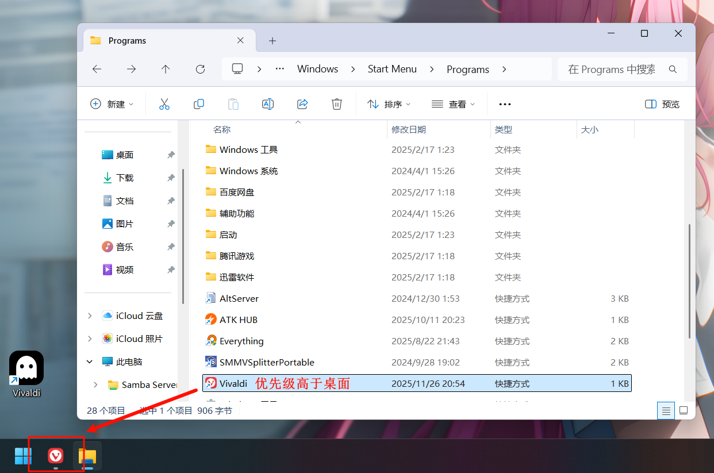
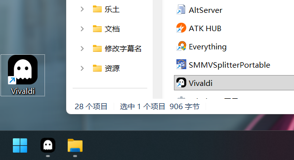

Vivaldi 的默认图标一直让我有点难绷，看久了甚至开始怀疑是不是我审美出了问题
好在隐私模式的图标还算不错，Windows 换图标也不麻烦



# 问题描述

但事情并没有想象中顺利。

1. 给桌面 **快捷方式** 更换图标一切正常
2. 但 **任务栏上的图标完全没有变化**
3. 取消固定 / 重新固定任务栏依旧无效

乍一看像是 Windows 又在整什么缓存，重启大法也试了，结果毫无作用

# 排查过程

一开始我以为任务栏直接读取的是 exe 的图标，不管换 exe 还是快捷方式图标依旧是：

- 桌面快捷方式 → 图标已更新
- 任务栏图标 → 顽固地保持原样

这就很不对劲了。

然后就是疯狂的检索信息，搜索引擎、Windows 社区、AI，期间尝试过太多方法，已经忘了从哪获得到的正确答案：
**如果开始菜单中存在该应用，任务栏固定时会优先使用开始菜单里的快捷方式图标，而不是桌面的。**

开始菜单路径：
```
%AppData%\Microsoft\Windows\Start Menu\Programs
```

这里存放的，才是任务栏真正认的「本体」



> 排查过程中发现，将已修改图标的快捷方式直接固定到任务栏可以暂时解决现象，但这并非根本解决方案   
> 这样做确实可以让任务栏图标立刻生效，因为任务栏此时引用的就是这份被修改过的快捷方式。  
> 不过这个方法本质上只是绕开了 Windows 的图标优先级逻辑，而不是修正它本身。加上我也不习惯将应用固定到任务栏上，所以并没有采用这种方式，继续向下排查。

# 解决方案

知道了优先级那就很好解决了
#### 方案一
打开上面的路径，修改开始菜单中的快捷方式图标
> `%AppData%\Microsoft\Windows\Start Menu\Programs`

#### 方案二
直接**删除**开始菜单下的快捷方式

#### 效果
修改完成后再次打开应用，任务栏图标立刻变成了新样子：



# 补充说明

- 某些应用更新后可能会重新生成快捷方式，图标会被覆盖
- 这套逻辑在 Win10 / Win11 下都成立

总之，Windows 的图标优先级依旧是那套祖传逻辑，知道入口之后也就不算什么大问题了。