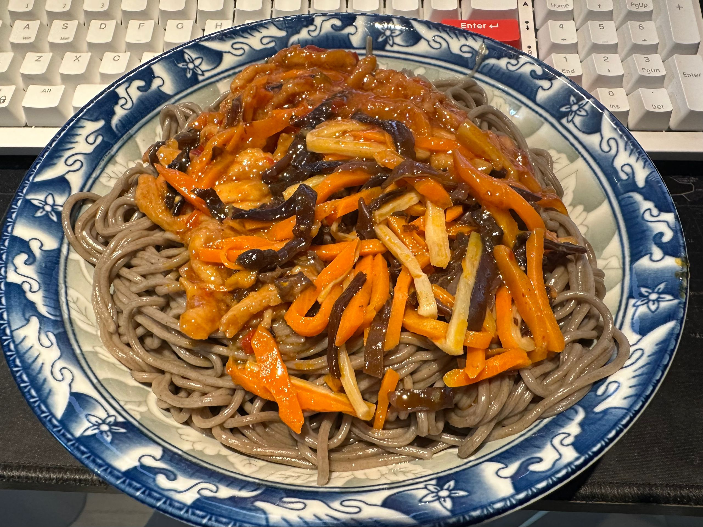
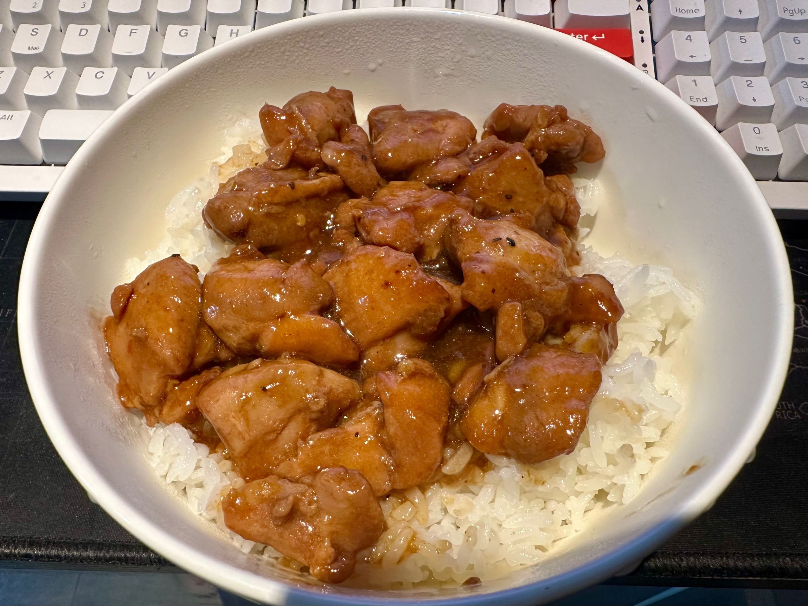
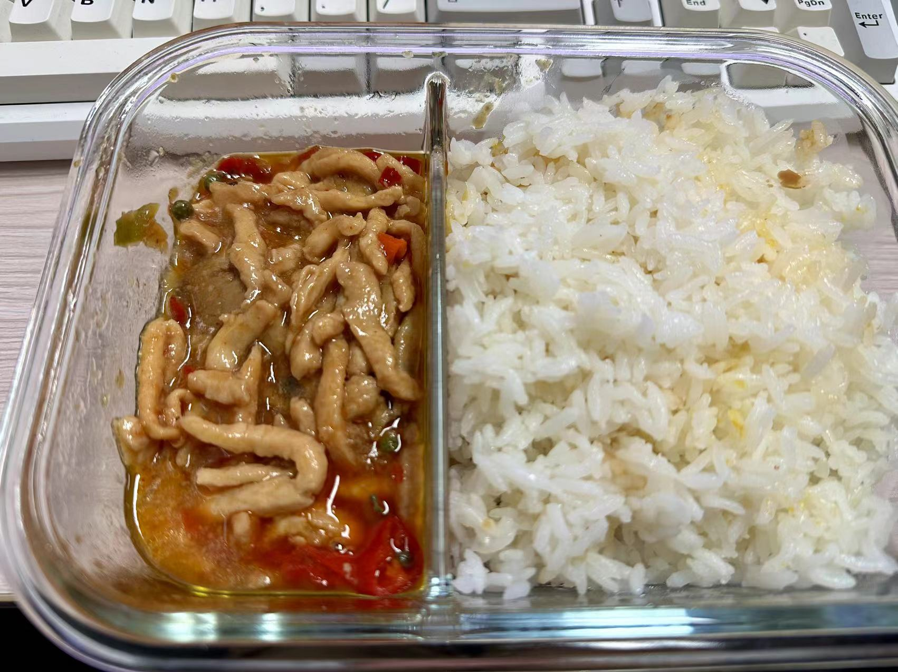
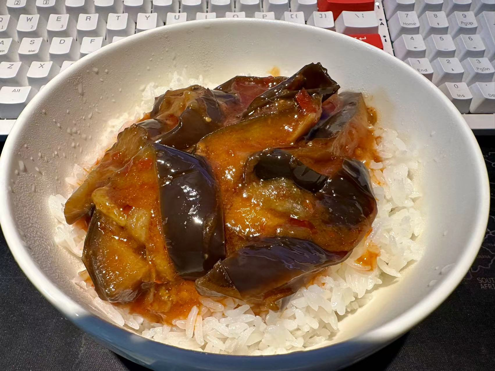
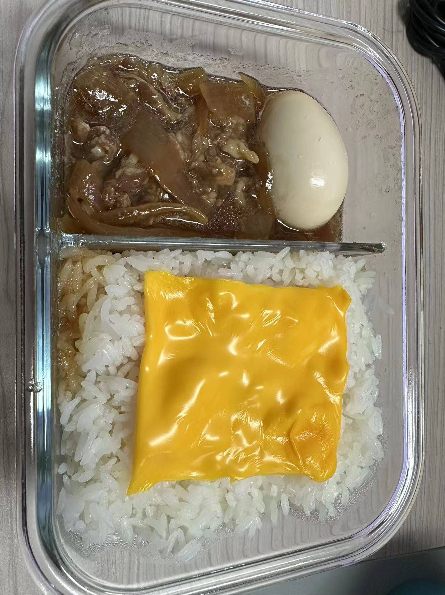

# 起因

最近讨伐预制菜的呼声很高，主要还是因为预制菜冒充现做菜  
抛开事实不谈，如果点的低价外卖都是预制菜，那为何不直接加入预制菜？  
选择困难的我在一连看了几个大品牌预制菜后决定丢掉大脑开始踩坑，~~毕竟吃的东西光看评测也看不出来什么~~  
最后在淘宝上入了谷言销量最好的套装，算上自己蒸的米饭平均一餐6块左右
> 购买信息  
> 款式：经典10种  
> 价格：57.80 RMB

**
废话少说，开吃！
**


注意：本篇文章主观性极强！


# 吃吃吃

## 卤肉饭 ★★★★★
> 居然还有点东西？

味道偏咸一点，但汤汁很下饭，比较适合重口味的人（看来大家说料理包口味偏重不是没有道理）  
肥肉的部分也不腻，比永和大王的卤肉饭好吃  
第一次评测自己买的预制菜，有点超乎预期先给五星吧  

## 咖喱鸡丁 ★★★✰✰
> 感觉不如好侍……味道  

中规中矩，就是很普通的外卖咖喱，虽然鸡肉的味道不错配菜也挺丰富，但是咖喱的量实在是有点少（缺乏灵魂）  

> 中午吃太快忘记拍照了，偷个买家秀顶替一下~

## 鱼香肉丝 ★★★✰✰
> 🐷：躲过一劫

配菜挺丰富（预制菜的特点？）虽然是鸡肉但也没有影响口感，是的你没看错，是用鸡肉炒的鱼香肉丝  
总体来说就是一份普普通通的鱼香肉丝，我平时去饭店也不会点这道菜所以就不多评价了

## 可乐鸡 ★★★★★
> 🌶️喜阳香同款？？

不出所料果然是辣的可乐鸡，和楼下饭店的味道一样呢  
鸡肉很嫩口感不错，辣度算微辣  
还是挺好吃的，嗝~

## 藤椒肉丝 ★★★★★
> 🐷：看来是用不到我了

藤椒肉丝味道的藤椒肉丝，能尝出花椒的麻味，也是鸡肉版  
和外卖小碗菜藤椒肉丝的味道差不多，但要更好吃一点点  

## 鱼香茄子 ★★★★★
> 🍆：谢谢

茄子非常软烂，豆瓣酱的味道很明显，配合汤汁吃下一大碗饭绰绰有余  
但是单吃茄子后面还是有点腻，建议自备汽水  

## 日式肥牛 ★★★★✰
> 这次是真不能用鸡肉顶替了

可能是牛肉的关系分量对比其他的菜品肉眼可见的少了，但是味道还不错  
为了防止吃不饱又加了一个蛋和芝士片，牛肉的味道偏甜一点，抛开分量不谈还是挺不错的    

---
**To be continued**