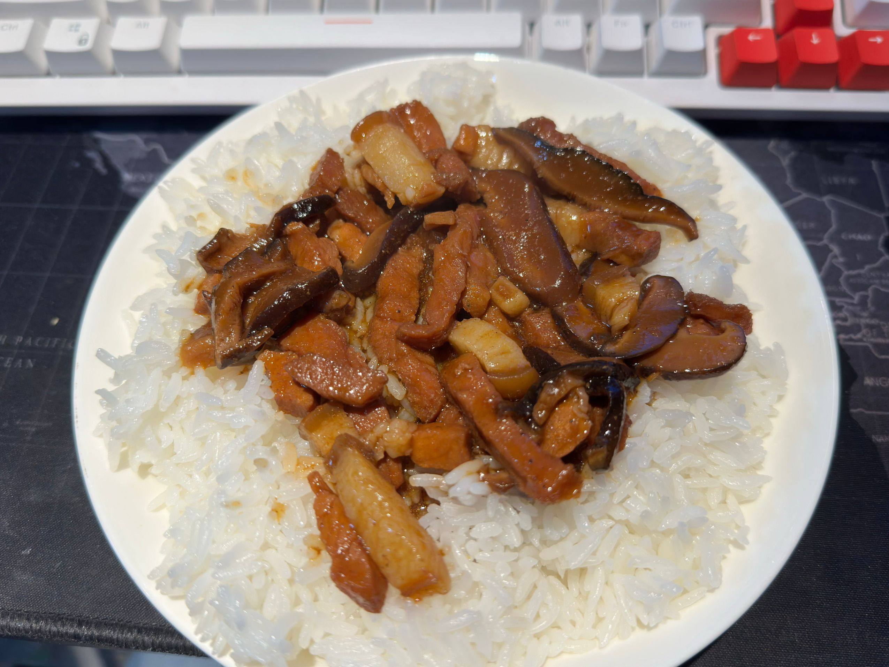
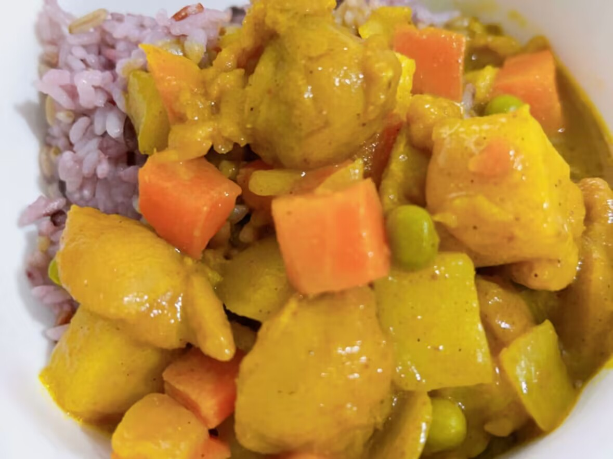

# 起因

最近讨伐预制菜的呼声很高，主要还是因为预制菜冒充现做菜  
抛开事实不谈，如果点的低价外卖都是预制菜，那为何不直接加入预制菜？  
选择困难的我在一连看了几个大品牌预制菜后决定丢掉大脑开始踩坑，~~毕竟吃的东西光看评测也看不出来什么~~  
最后在淘宝上入了谷言销量最好的套装，算上自己蒸的米饭平均一餐6块左右
> 购买信息  
> 款式：经典10种  
> 价格：57.80 RMB

**
废话少说，开吃！
**


注意：本篇文章主观性极强！


<link rel="stylesheet" href="/css/custom/AddTitleIcon.css">

# 吃吃吃

## 台式卤肉饭 ★★★★★
> 居然还有点东西？

味道偏咸一点，但汤汁很下饭，比较适合重口味的人（看来大家说料理包口味偏重不是没有道理）  
肥肉的部分也不腻，比永和大王的卤肉饭好吃  
第一次评测自己买的预制菜，有点超乎预期先给五星吧  

## 咖喱鸡丁 ★★★✰✰
> 感觉不如好侍……味道  

中规中矩，就是很普通的外卖咖喱，虽然鸡肉的味道不错配菜也挺丰富，但是咖喱的量实在是有点少（缺乏灵魂）  

> 中午吃太快忘记拍照了，偷个买家秀顶替一下~

## 鱼香肉丝 ★★★✰✰
> 🐷：躲过一劫

配菜挺丰富（预制菜的特点？）虽然是鸡肉但也没有影响口感，是的你没看错，是用鸡肉炒的鱼香肉丝  
总体来说就是一份普普通通的鱼香肉丝，我平时去饭店也不会点这道菜所以就不多评价了

## 可乐鸡 ★★★★★
> 🌶️喜阳香同款？？

不出所料果然是辣的可乐鸡，和楼下饭店的味道一样呢  
鸡肉很嫩口感不错，辣度算微辣  
还是挺好吃的，嗝~

## 藤椒肉丝 ★★★★★
> 🐷：看来是用不到我了

藤椒肉丝味道的藤椒肉丝，能尝出花椒的麻味，也是鸡肉版  
和外卖小碗菜藤椒肉丝的味道差不多，但要更好吃一点点  

## 鱼香茄子 ★★★★★
> 🍆：谢谢

茄子非常软烂，豆瓣酱的味道很明显，配合汤汁吃下一大碗饭绰绰有余  
但是单吃茄子后面还是有点腻，建议自备汽水  

## 日式肥牛 ★★★★✰
> 这次是真不能用鸡肉顶替了

可能是牛肉的关系分量对比其他的菜品肉眼可见的少了，但是味道还不错  
为了防止吃不饱又加了一个蛋和芝士片，牛肉的味道偏甜一点，抛开分量不谈还是挺不错的    

## 梅菜扣肉 ★★★★★
> 感觉被点燃了梅菜扣肉之魂

由于我平时不吃肥肉所有没有怎么尝试过梅菜扣肉，但这次买的套餐里有，抱着不能浪费的心理尝了尝  
你别说 还真别说  
六片五花肉下面压着一大堆梅菜，嘎嘎下饭
下次或许会去饭店尝试一下现炒的  
 

## 黄豆焖猪肘 ★★★★★
> 朱元璋吃了都说好

猪肘很软糯，朴实无华的好吃  
就是分量太少  

## 农家小炒肉 ★★✰✰✰
> 农家小炒肉❌ 萝卜干炒肉 ✔️

可惜不是川菜的做法，原本对这道菜的期望值还挺高(之前家门口有一家川菜店的小炒肉盖饭非常好吃，可惜现在不卖盖浇饭了)  
里面放了很多萝卜干，不知道是哪里的做法但是整体味道一般  

## 辣子鸡丁 ★✰✰✰✰
> 负分！

和我想象的辣子鸡丁完全不同，首先是不辣，而且还放了胡萝卜和青豆？？  
最最关键的是：不好吃！！  
味道真的是一言难尽，只能算是能吃，如果第一道菜就吃这个估计我也要加入声讨预制菜的队伍了  

## 毛式红烧肉二号 ★★★★★
> 好吃好吃好吃

土豆很绵，五花肉肥而不腻
分量还是很足的，但瘦肉部分略微有点老
预制菜这水平很不错了 

## 黑椒牛柳 ★★★★✰
> 黑胡椒酱上大分

味道像黑胡椒酱，虽然牛肉很嫩但蔬菜的部分不太行，萝卜是蔫的
总体瑕不掩瑜，还是挺下饭的，不知道是牛肉的功劳还是黑胡椒酱的功劳

## 日式红烧肉 ★★★★✰
> 糖醋红烧肉

肥肉和传统红烧肉的软糯不太一样，很Q弹
瘦肉很柴，味型很像糖醋味
配菜有香菇洋葱
总体还是还是不错的

## 宫保鸡丁 ★✰✰✰✰
> 好难吃啊啊啊啊啊

甜口的宫保鸡丁，而且又很油腻  
胡萝卜占了大半，完全不推荐

## 黄焖鸡 ★★★★★
> 配上热气腾腾的砂锅无敌

土豆很绵，鸡肉很嫩  
非常入味，很下饭

## 黑椒牛肉丸 ★✰✰✰✰
> 丸子滞销，帮帮我们！

单纯的黑胡椒酱拌丸子，而且黑胡椒酱味道很大，吃不出其他味道  
口味重不下饭，但有黑椒酱加持又谈不上难吃   
总体就是黑胡椒酱拌饭

---
**To be continued**