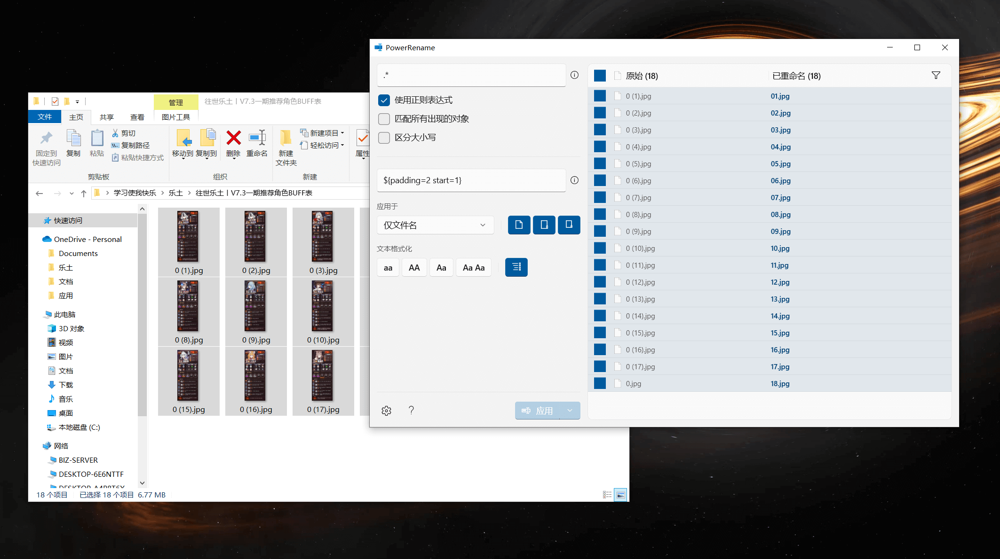
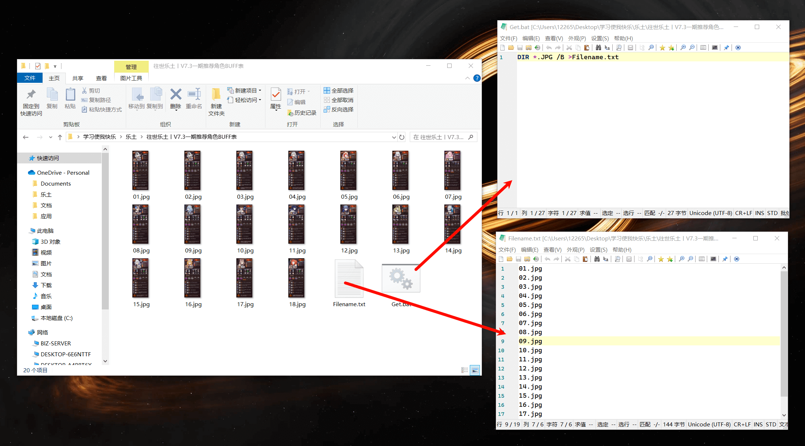
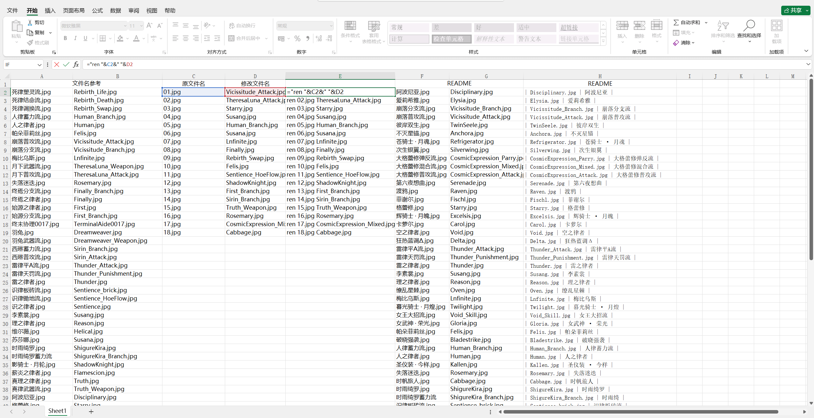
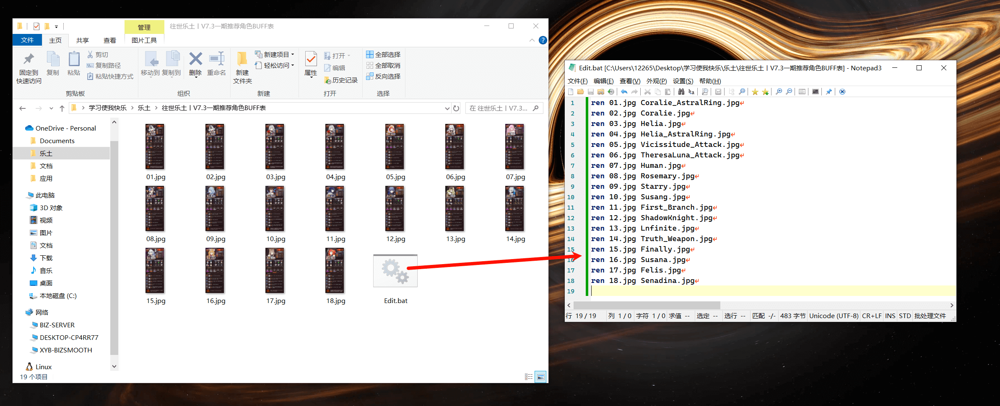
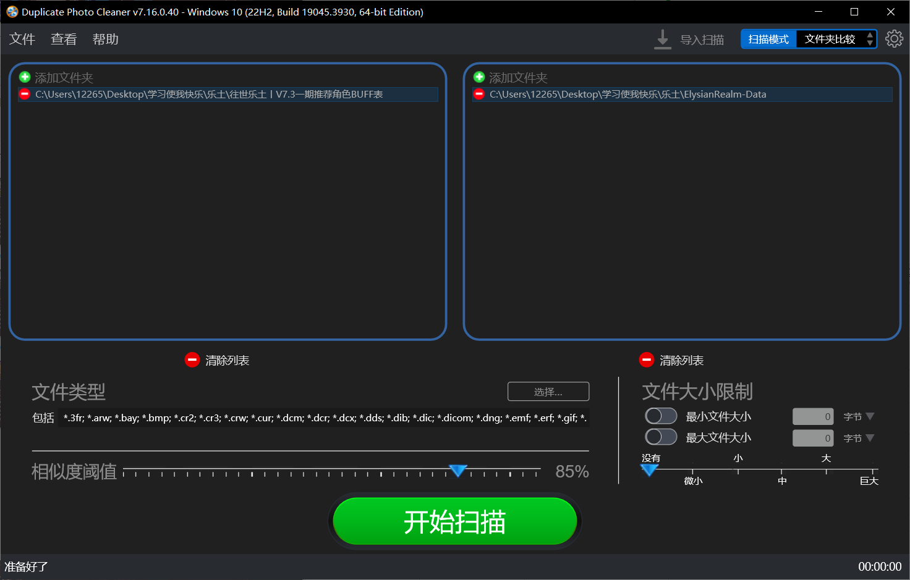
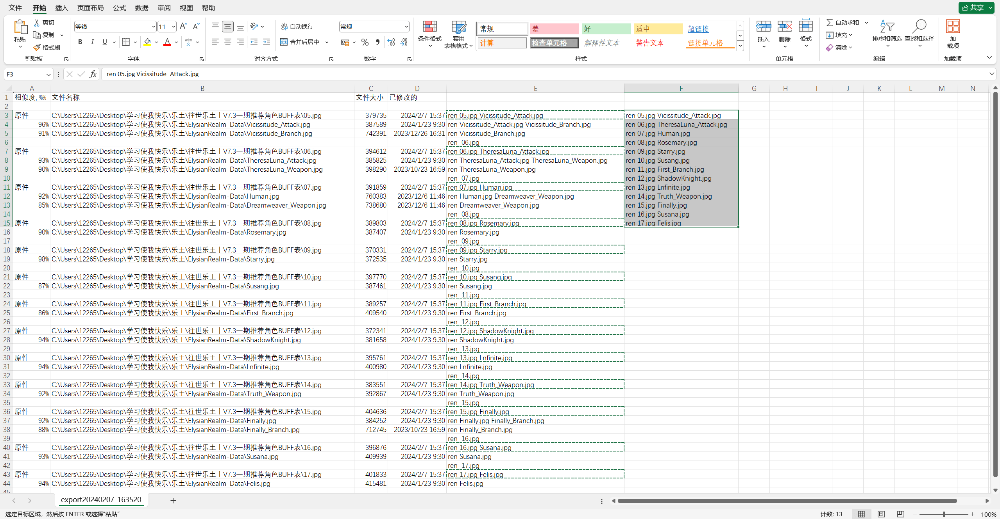
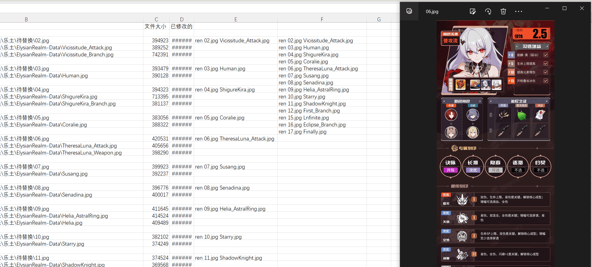
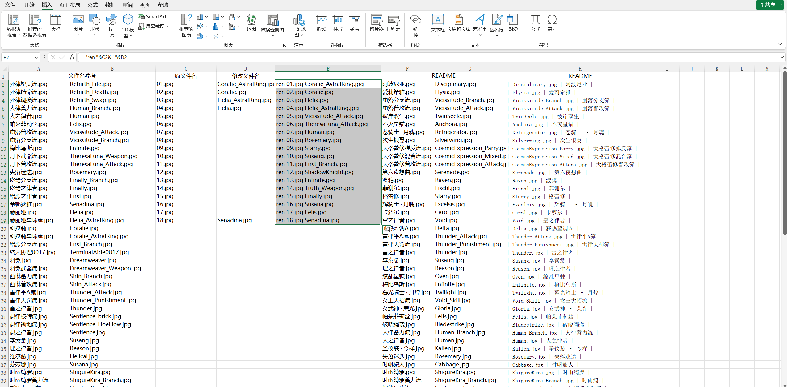

为了维护攻略图床，每隔半个多月就要更新一部分图片，记录一下批量替换图片的方案  

## 重命名并排序

首先对批量下载的图片进行预处理
这里使用的工具是 [Microsoft PowerToys](https://aka.ms/PowerToysOverview) 中的 [PowerRename](https://aka.ms/PowerToysOverview_PowerRename) 
> Microsoft PowerToys 是一组实用工具，可帮助高级用户调整和简化其 Windows 体验，从而提高工作效率。
> PowerRename 是一种批量重命名工具

1. 使用正则 `.*` 匹配当前目录下所有图片
2. 使用替换规则 `${padding=2 start=1}` 重命名图片


## 获取文件名

1. 新建一个txt，复制以下内容后以 `ASNI` 编码另存为 `Get.bat`
```bat
DIR *.JPG /B >Filename.txt
```
2. 在图片目录下双击运行生成 `Filename.txt`


## 替换文件名

这边有两种做法，推荐第二种  
- 使用 Excel 手动选择需要替换的文件名，利用 Excel 公式生成 bat 脚本后批量替换
- 使用 Duplicate Photo Cleaner 快速筛选近似的图片，导出数据后做查缺补漏


<!-- tab Excel @fa-solid fa-table -->
### 使用 Excel 替换文件名
> [下载Excel模板](580597065/修改文件名.xlsx)

1. 将原文件名放在 `C 行` ，要修改的文件名放在 `D 行`
2. 在 `E 行` 使用下面 Excel 公式生成 bat 脚本代码
```excel
="ren "&C2&" "&D2
```
3. 使用快速填充功能批量复制公式

> 文中使用的C D E行以模板为例，可以自行修改公式

4. 新建一个txt，复制 `E 行` 内容后以 `ASNI` 编码另存为 `Edit.bat`
5. 图片目录下双击运行完成修改

<!-- endtab -->

<!-- tab Duplicate Photo Cleaner @fa-regular fa-file-image -->
### 使用 Duplicate Photo Cleaner
> Duplicate Photo Cleaner 是一款专门设计用于帮助用户在计算机上查找和删除重复照片的软件

借助 Duplicate Photo Cleaner 就可以快速完成相似图片的更新操作，开始前建议先阅读第一种方法（熟练使用Excel无视）
1. 选择需要对比的文件/文件夹，并设置相似度阈值（建议85左右）

2. 将处理好的文件导出为 CSV 或 Excel

3. 在导出的 Excel 中使用下面 Excel 公式，在路径中提取文件名生成 bat 脚本代码
```excel
=CONCATENATE("ren ",TRIM(RIGHT(SUBSTITUTE(B3,"\",REPT(" ",99)),99))," ",TRIM(RIGHT(SUBSTITUTE(B4,"\",REPT(" ",99)),99)))
```
4. 按住 Ctrl 后依次选中原件一行的数据，复制到空白单元格

5. 核对数据并检查其他相似结果

6. 将处理好的数据粘贴到 Excel（[模板](580597065/修改文件名.xlsx)）中查缺补漏

7. 新建一个txt，复制 `E 行` 内容后以 `ASNI` 编码另存为 `Edit.bat`
8. 图片目录下双击运行完成修改

<!-- endtab -->




