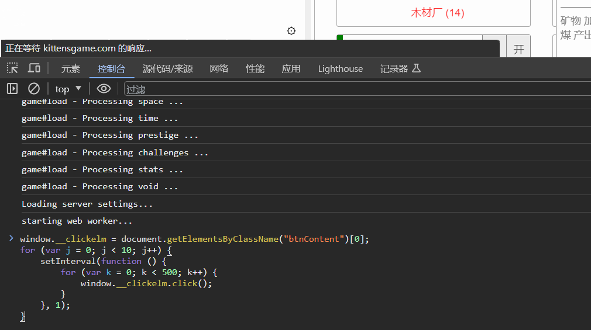
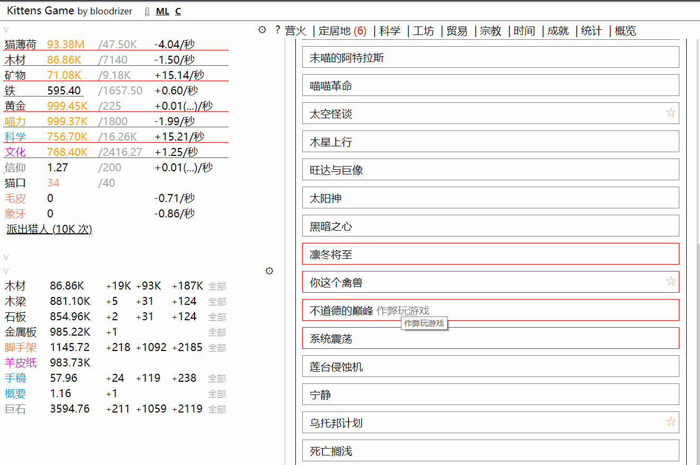
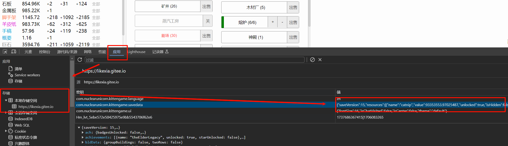
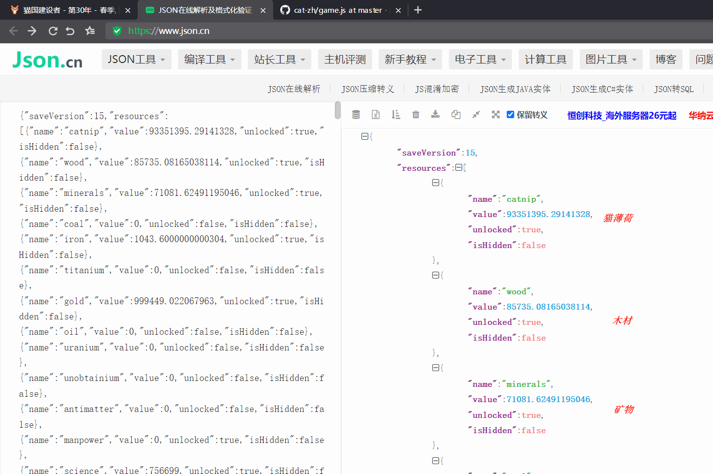
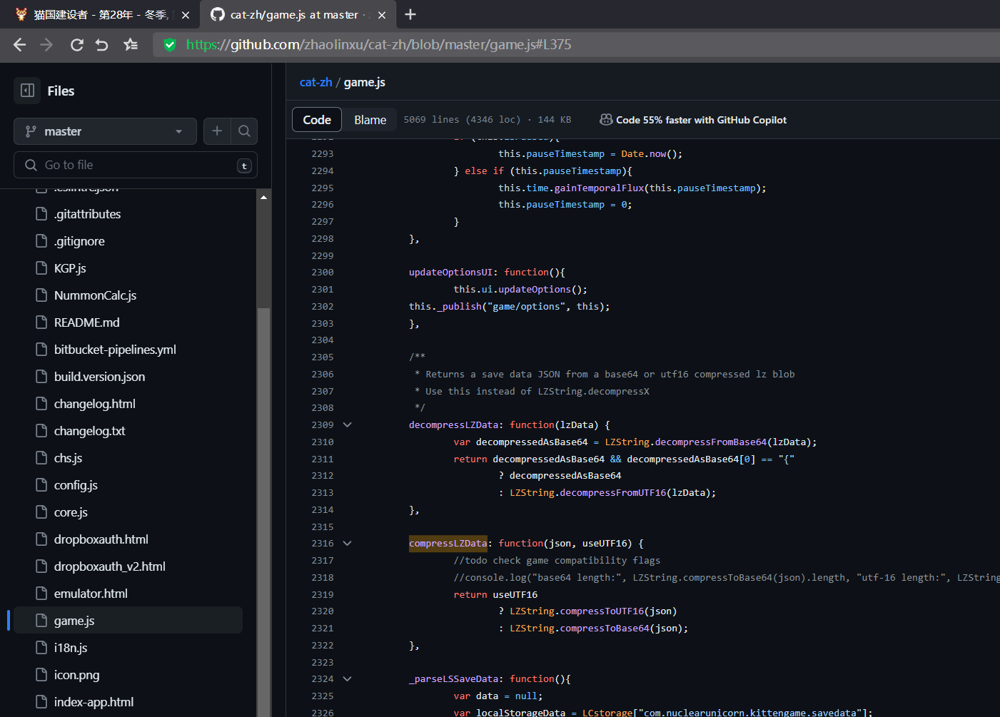
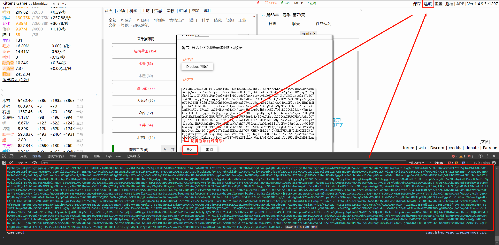

# 猫国建设者 (Kittens Game)
> 网址：[游戏](https://kittensgame.com/web/) | [Wiki](https://lolitalibrary.com/wiki/)

《猫国建设者》是一款由 bloodrizer 开发的文字放置村庄管理网页游戏。在游戏里，你管理着一个村庄的猫咪，它们会不断地获取资源、学习技术。

# 使用 JS 连点器获取猫薄荷

注意：会解锁成就：不道德的巅峰（作弊玩游戏）


1. 开启浏览器控制台后直接粘贴下面的代码
```JavaScript
window.__clickelm = document.getElementsByClassName("btnContent")[0];
for (var j = 0; j < 10; j++) {
    setInterval(function () {
        for (var k = 0; k < 500; k++) {
            window.__clickelm.click();
        }
    }, 1);
}
```
> 由于 JS 是单线程，绑定一个多次点击的定时器的性能要小于绑定多个定时器



2. 关闭控制台后继续游戏以提高性能

---

# 修改游戏存档

警告：修改存档获取资源后游戏将立即索然无味！




**<center>既然你已经做好了索然无味的准备，那么来吧！</center>**

## 导出存档

1. 游戏设置中导出的存档是进行过字符串压缩的，我们可以直接在浏览器缓存中获取原始Json
 
> F12开启控制台

2. 拿到Json后就可以开始修改数值了
 
> JSON在线解析：https://www.json.cn/
## 转码并导入

 翻看[源码](https://github.com/zhaolinxu/cat-zh/blob/master/game.js#L2316)会发现存档使用了 LZString 进行压缩

 

 我们可以直接在控制台中调用 `compressLZData()` 方法加密修改后的存档

```JavaScript
game.compressLZData('这里填入修改后的Json',false);
```
1. 补全上面代码后输入控制台获取压缩后的Json数据
2. 在游戏设置中导入存档
   
> 记得删除数据的前后引号！




