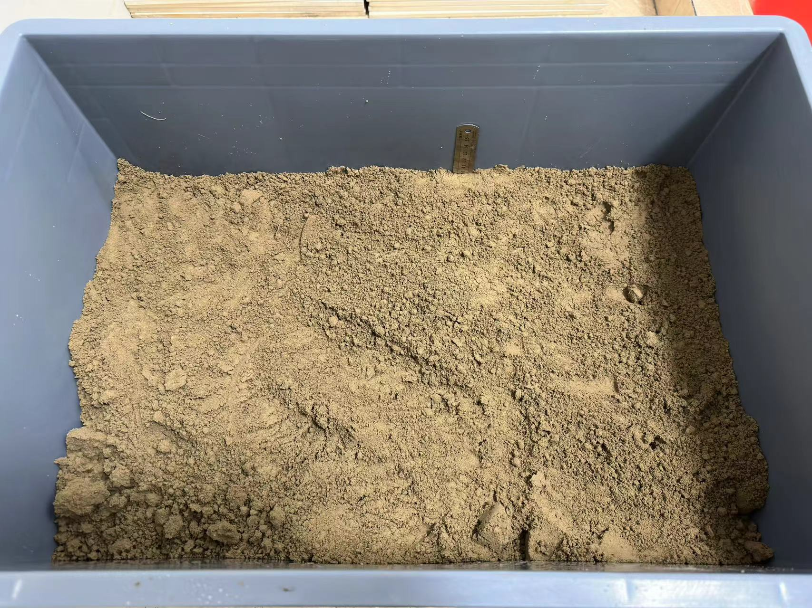
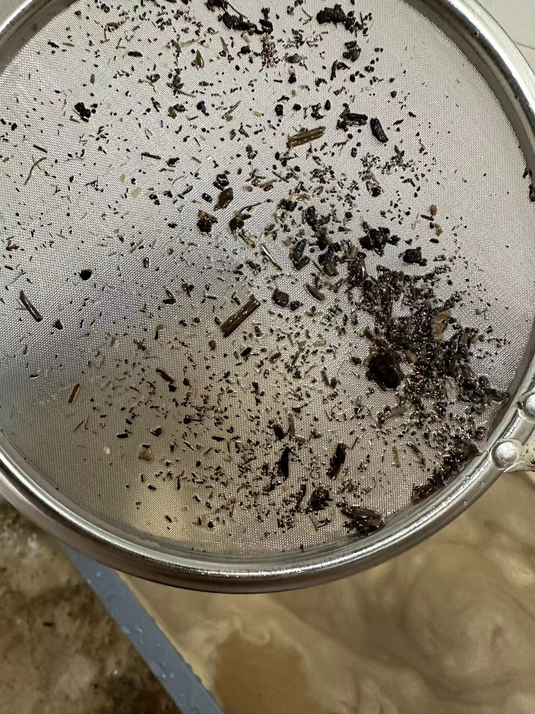
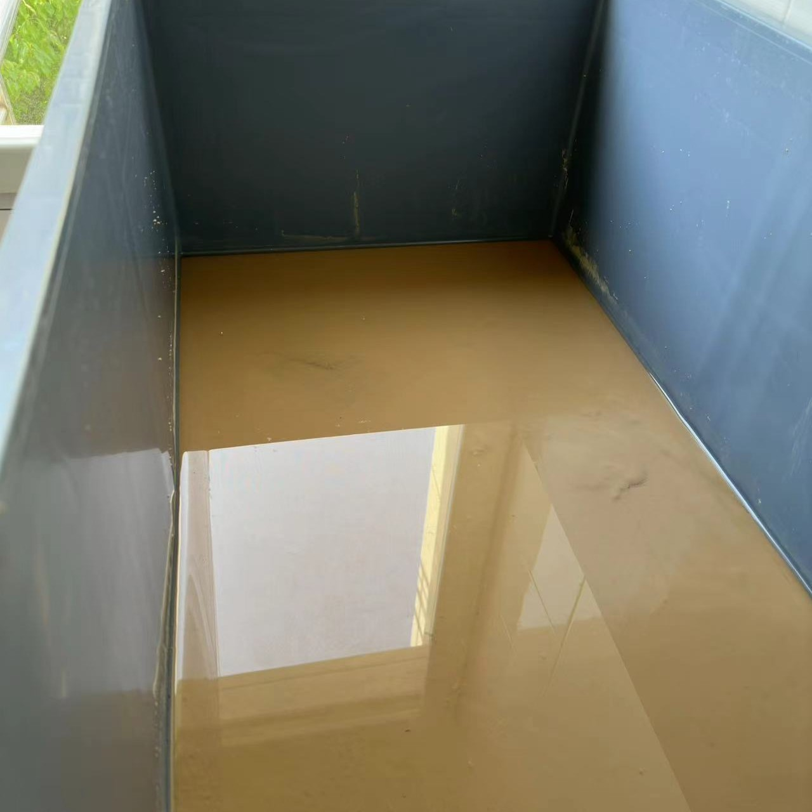
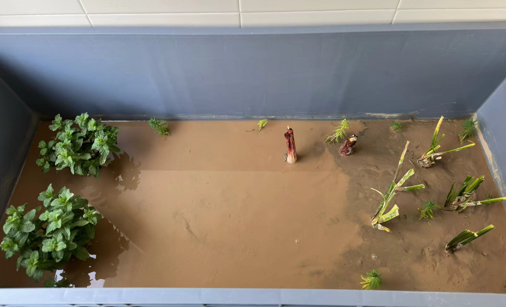
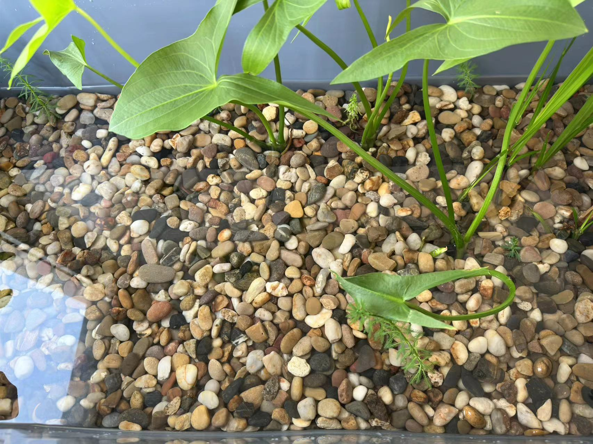
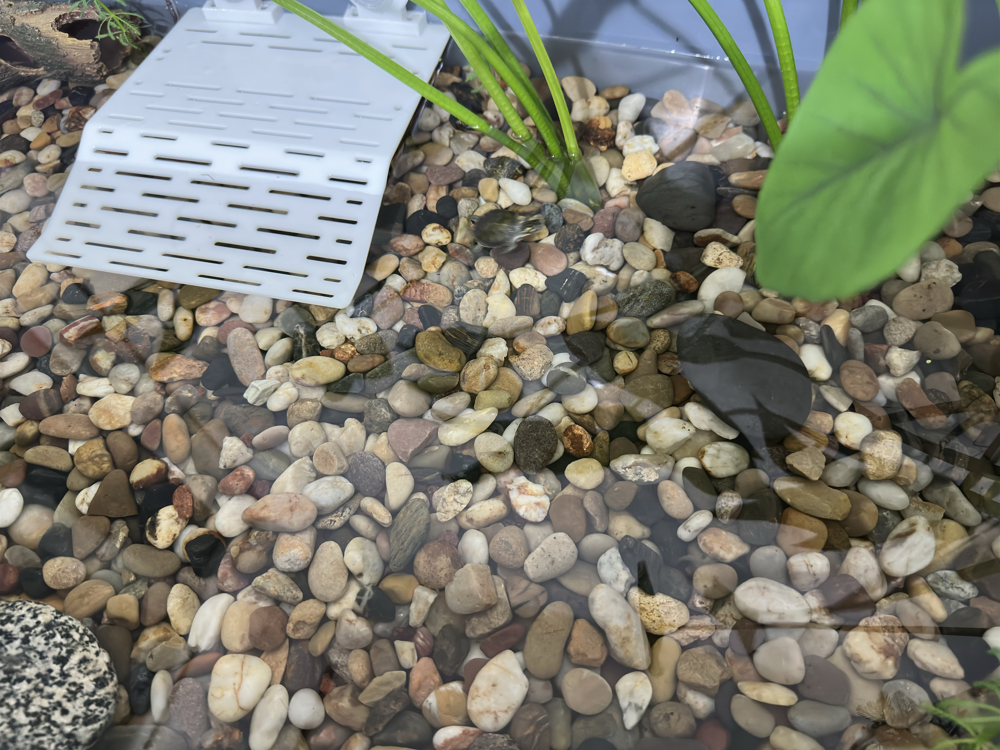
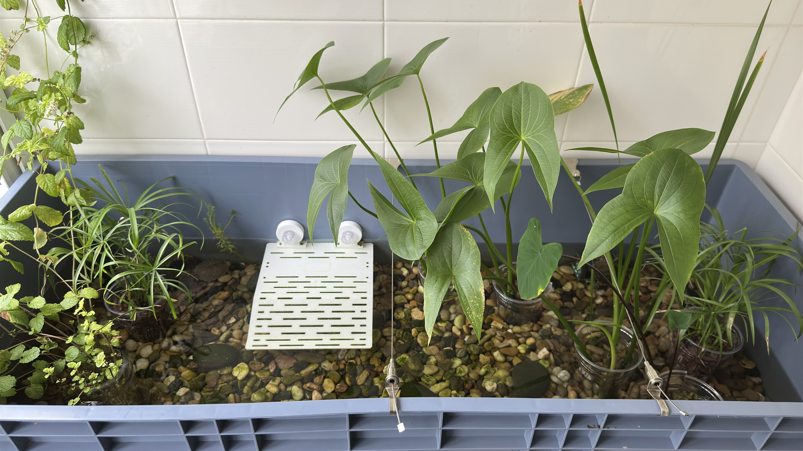
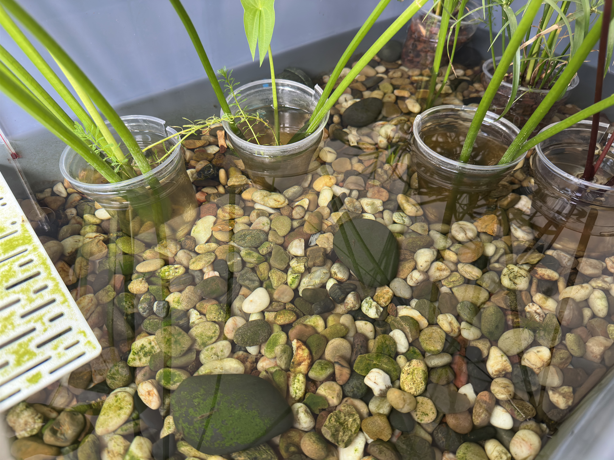

# 材料清单

## 龟缸

- 周转箱（1200x500x380cm）1个 ￥114.6
- 周转箱（600x400x280cm）1个 ￥29


 



## 底沙

- 荷塘泥 40kg ￥60
- 火山石（3-6mm）10kg ￥14.8
- 火山石（5-8mm）10kg ￥14.8
- 溪流石（1-3cm）10kg ￥39.7
> 火山石可以酌情再加5kg

 
 

  
## 挺水植物
> 植物可以先买回来养着生根

- 薄荷（留兰香）2盆 ￥9.6
- 狐尾藻 10颗 ￥4.8
- 水菖蒲 5株 ￥5
- 水芙蓉 5株 ￥5
- 慈姑 3颗 ￥7
- 紫芋 2颗 ￥6

## 净水鱼虾
> 用于试水兼饲料（龟龟自助餐）

- 青鱂（0.5-1cm）30条 ￥13.8
  > 清理水面油膜以及龟龟吃剩的龟粮
- 黑壳虾 60只 ￥9.9
  > 清理缸内水藻

## 饲料
- 海豚龟粮（黄色包装）200g ￥8.5
- 淡水虾干
  > 乌龟不能吃盐分高的食物，代谢不掉
- 丰年虾卵 50g ￥6
  > 喂鱼虾

## 其他

- 高锰酸钾 一盒24片 ￥2
- 滤网 1个 ￥5
- 喂食镊子 1个 ￥3
- 塑料洗菜盆（27x20x8cm） 1个 ￥2
- 周转箱拉筋 2个 ￥3.5
  > 建议淘宝搜挂画器

**总成本 ￥304**

# 铺设底砂

## 清洗底泥

1. 把荷塘泥倒入小号周转箱后加开水杀灭虫卵（也可以直接洗）    
     

   > 20kg 荷塘泥在 60x40x28cm 干的状态大概是 10cm 左右，加水沉淀后滤出杂质大概是 5.6 cm
2. 等水完全浸透塘泥后将其揉搓均匀，使用漏网捞出杂质（细小的枝干，较大的石子等）  
     

3. 过滤杂质后等待塘泥沉淀（大约 30-60 分钟），并倒出多于的水将荷塘泥转入大周转箱内 
4. 在大周转箱中铺平塘泥，等待沉淀后继续捞出表面的杂质  
     
   
   > 40kg 荷塘泥在 120x50x34cm 的周转箱中沉淀后的厚度大概是 4.5cm
5. 杂质打捞干净后乘出多于的水，尽量减少水份，方便后续固泥（晒泥）
     

## 种植植物、固泥


这是一条从2024年11月11日发来的Dmail，由于之前栽种植物没有使用定植篮，在这个时间线中多数植物被龟龟啃咬至死，希望你看到这条消息能够使用定植篮保护植物，也方便在植物枯死后更换



植物种植前先浸泡 20 分钟高锰酸钾杀虫杀菌（大概稀释到淡紫色 <color style="display: inline-flex;width: 30px;height: 30px;background-color: #a08cdcc4;">&nbsp;</color> #a08cdcc4 ）


1. 杂质捞净后开始种植植物（不用种很深），可以提前在植物周围堆点 3-6mm 的火山石来稳固枝干
   - 慈姑：洗干净泡水，等待生根后再移入
   - 水芙蓉：找个容器先养起来，等正式加水后再放入
2. 期间保持泥土湿润并观察植物长势，等植物开始长出新芽时进入固泥阶段  
    
   > 5月19日开始固泥
3. 耐心等待泥土干燥硬化，到手指无法轻松按下时加入水进行二次固泥（使泥土更够支撑火山石，不易浑水） 
    
   > 5月27日泥土开裂，但表面依旧湿润 (距离第一次固泥间隔8天) 继续等待....

   
   > 6月2日泥土表面干燥,植物有垂头迹象，开始二次固泥 (距离第一次固泥间隔14天)  
   > 但紫芋没能发芽成功，替换成了之前水培的慈姑，慈姑水培一周到开始有新芽就行了，半个月根系太长不好移植  

4. 再次等待底泥完全干透后，完成固泥
   > 6月16日，泥土表面再次干燥，进入下一阶段 (距离第一次固泥间隔大约28天)  
  

## 清洗火山石与溪流石


火山石中有非常多的泥沙，一定要洗！


由于火山石中有大量的泥沙沉底，建议准备两个容器和一个洗菜盆  

1. 将容器1中注水后开始用洗菜盆淘洗火山石，之后捞出转移到容器2中
2. 将容器1中剩余的泥沙倒出后为容器2注水，并继续淘洗至容器1中
3. 循环直到火山石入水不浑水
   
可以在淘洗泥沙快要结束时浸泡 30 分钟高锰酸钾溶液后再进行最后的淘洗（泡完高锰酸钾后也要洗，不如一起做了）

## 放置火山石与溪流石

将材料按照 `3-6mm 火山石 -> 5-8mm 火山石 -> 1-3cm 溪流石` 的顺序**从小到大**堆叠在荷塘泥上，溪流石为了防止龟翻动火山石导致浑水

 


> 铺完火山石后，底砂厚度大概是 7cm

 
 

> 铺完溪流石后，底砂厚度大概是 10cm

# 试水

初次加水后轻微浑水是正常现象，沉淀一晚后会变清  
刚出生的龟龟建议先浅水养，之后慢慢加水使其适应深水，同时晒台位置建议多一点，防止溺水  
长到3-4cm的龟龟可以正常深水养，但也要有晒台

# 完成

目前已经稳定运行了一个月左右，只加水不换水  
由于龟苗不能一下子适应深水，需要先浅水养，之后慢慢加水  
后续会继续更新龟缸状态

 
 

> 水芙蓉已经被啃完了...

---

# 日常记录

## 2024 年 6 月

- 6 月 14 日


 
 

> 生！生啦！

## 2024 年 7 月

好快的速度，没拍清
 

<iframe height=640 width=360 src="2169866522/记录/240715.mp4"></iframe>

## 2024 年 8 月

这龟疯狂霍霍我植物，最后买了点奶茶杯给绿植保护起来了  
以后开缸和补种还是埋一个定植篮吧，方便更换还能保护植物
<iframe height=360 width=780 src="2169866522/记录/240816.mp4"></iframe>

## 2024 年 9 月

 

<iframe height=600 width=480 src="2169866522/记录/240909.mp4"></iframe>

> 龟龟直升机！

## 2024 年 11 月

黑壳虾都要爆缸了愣是一口吃不着...
<iframe height=640 width=360 src="2169866522/记录/241101.mp4"></iframe>

 
> 已稳定运行半年

---
**To be continued**