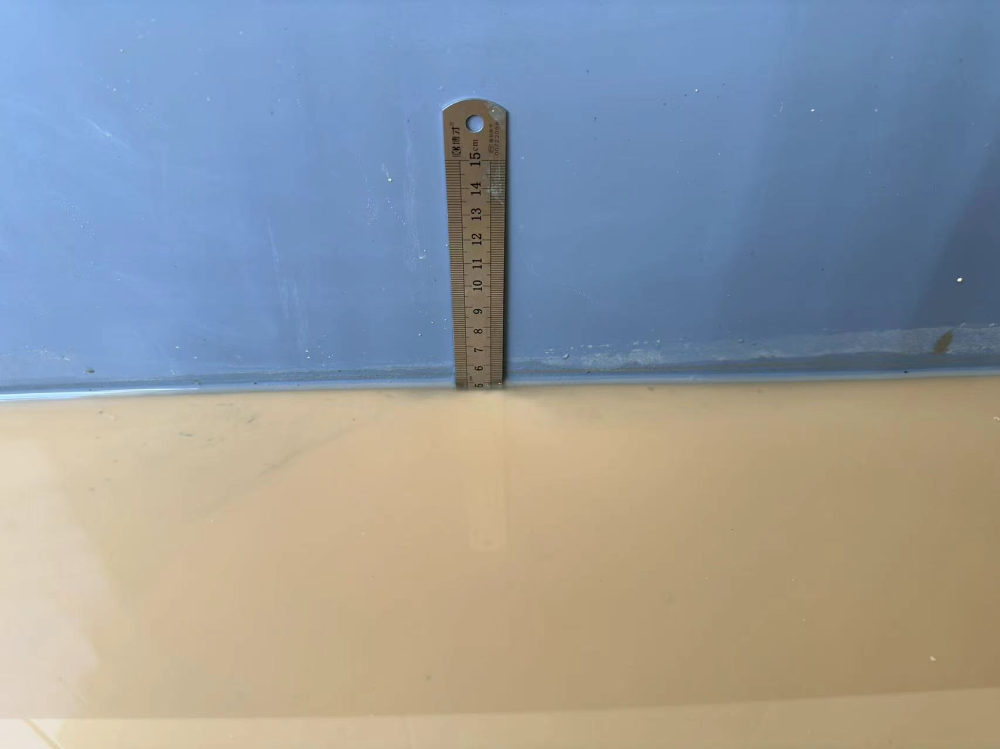
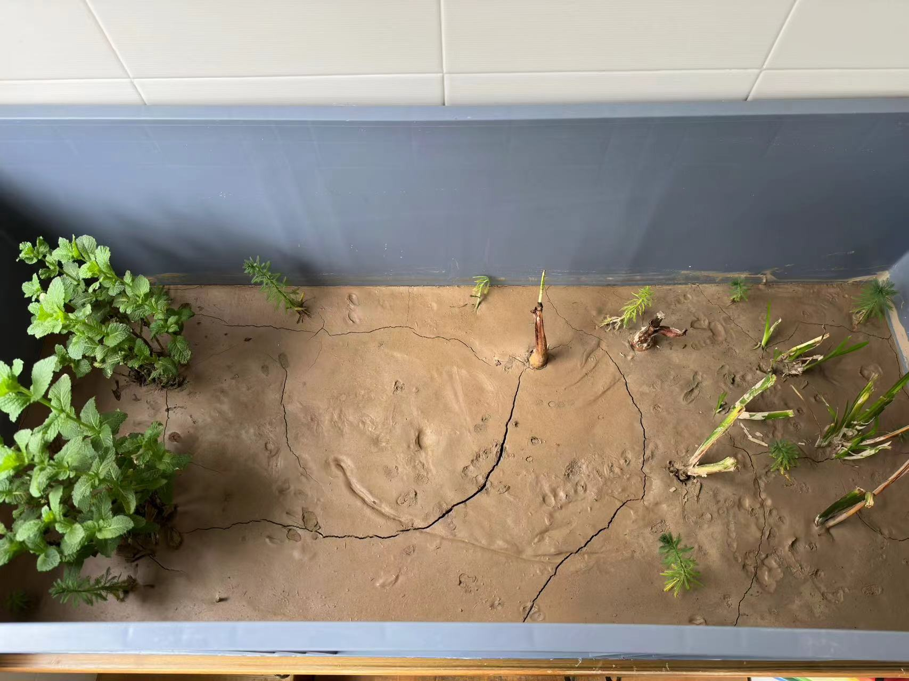
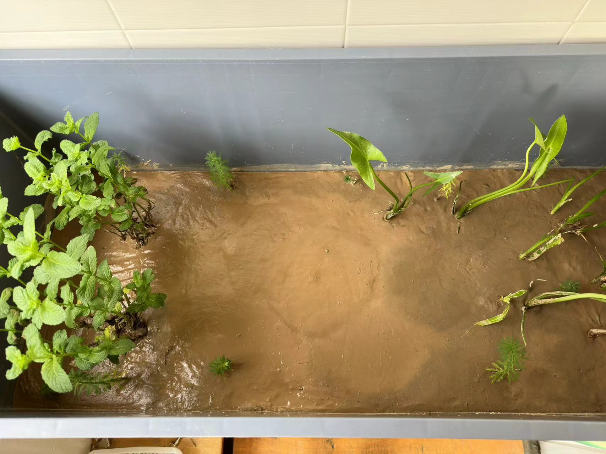

# 目前进度

- [x] 购买材料
- [x] 淘洗底沙
- [x] 种植植物
- [x] 固泥
- [ ] 放置火山石与稀硫石头
- [ ] 放入鱼虾试水
- [ ] 完成

# 材料清单

## 龟缸

- 周转箱（1200x500x380）1个 ￥114.6
- 周转箱（600x400x280）1个 ￥29


 



## 底沙*（还未实践，不够再加）

- 荷塘泥 40kg ￥60
- 火山石（3-6mm）10kg ￥14.8
- 火山石（5-8mm）10kg ￥14.8
- 溪流石（1-3cm）暂未采购


 
 

  
## 植物
> 植物可以先买回来养着生根

- 薄荷（留兰香）2盆 ￥9.6
- 狐尾藻 10颗 ￥4.8
- 水菖蒲 5株 ￥5
- 水芙蓉 5株 ￥5
- 慈姑 3颗 ￥7
- 紫芋 2颗 ￥6

## 其他

- 高锰酸钾 一盒24片 ￥2
- 滤网 1个 ￥5
- 周转箱拉筋 2个 ￥3.5
  > 建议淘宝搜挂画器

# 清洗底沙

1. 把荷塘泥倒入小号周转箱后加开水杀灭虫卵（也可以直接洗）    
     

   > 20kg 荷塘泥在 60x40x28cm 干的状态大概是 10cm 左右，加水沉淀后滤出杂质大概是 5.6 cm
2. 等水完全浸透塘泥后将其揉搓均匀，使用漏网捞出杂质（细小的枝干，较大的石子等）  
     

3. 过滤杂质后等待塘泥沉淀（大约 30-60 分钟），并倒出多于的水将荷塘泥转入大周转箱内 
4. 在大周转箱中铺平塘泥，等待沉淀后继续捞出表面的杂质  
     
   
   > 40kg 荷塘泥在 120x50x34cm 的周转箱中沉淀后的厚度大概是 4.5cm
5. 杂质打捞干净后乘出多于的水，尽量减少水份，方便后续固泥（晒泥）
     

# 铺设底砂

## 种植植物、固泥


植物种植前先浸泡 20 分钟高锰酸钾杀虫杀菌（大概稀释到淡紫色 <color style="display: inline-flex;width: 30px;height: 30px;background-color: #a08cdcc4;">&nbsp;</color> #a08cdcc4 ）


1. 杂质捞净后开始种植植物（不用种很深），可以提前在植物周围堆点 3-6mm 的火山石来稳固枝干
   - 慈姑：洗干净泡水，等待生根后再移入
   - 水芙蓉：找个容器先养起来，等正式加水后再放入
2. 期间保持泥土湿润并观察植物长势，等植物开始长出新芽时进入固泥阶段  
    
   > 5月19日开始固泥
3. 耐心等待泥土干燥硬化，到手指无法轻松按下时加入水进行二次固泥（使泥土更够支撑火山石，不易浑水） 
    
   > 5月27日泥土开裂，但表面依旧湿润 (距离第一次固泥间隔8天) 继续等待....

   
   > 6月3日泥土表面干燥,植物有垂头迹象，开始二次固泥 (距离第一次固泥间隔14天)  
   > 但紫芋没能发芽成功，替换成了之前水培的慈姑，慈姑水培一周到开始有新芽就行了，半个月根系太长不好移植  


目前进度在这


4. 再次等待底泥完全干透后，完成固泥

## 放置火山石与溪流石

1. 将火山石与溪流石清洗干净并泡 30 分钟高锰酸钾溶液
2. 将材料按照 `3-6mm 火山石 -> 5-8mm 火山石 -> 1-3cm 溪流石` 的顺序堆叠在荷塘泥上，溪流石为了防止龟翻动火山石导致浑水

---
**To be continued**